# CodeCustodian — Detailed Feature Architecture

> Comprehensive architecture documentation covering every subsystem, SDK
> integration flow, data model, deployment topology, and security boundary.

---

## Table of Contents

1. [High-Level Architecture](#1-high-level-architecture)
2. [Pipeline Architecture](#2-pipeline-architecture)
3. [Scanner Subsystem](#3-scanner-subsystem)
4. [AI Planner Subsystem (GitHub Copilot SDK)](#4-ai-planner-subsystem-github-copilot-sdk)
5. [Executor Subsystem](#5-executor-subsystem)
6. [Verifier Subsystem](#6-verifier-subsystem)
7. [MCP Server Architecture (FastMCP v2)](#7-mcp-server-architecture-fastmcp-v2)
8. [Work IQ MCP Integration](#8-work-iq-mcp-integration)
9. [Enterprise Subsystem](#9-enterprise-subsystem)
10. [Intelligence Subsystem](#10-intelligence-subsystem)
11. [Feedback & Learning Subsystem](#11-feedback--learning-subsystem)
12. [Integrations Layer](#12-integrations-layer)
13. [Configuration Architecture](#13-configuration-architecture)
14. [Data Model Reference](#14-data-model-reference)
15. [Deployment Architecture (Azure)](#15-deployment-architecture-azure)
16. [Security Architecture](#16-security-architecture)
17. [Observability Architecture](#17-observability-architecture)
18. [SDK Integration Map](#18-sdk-integration-map)
19. [Planned Architecture Extensions](#19-planned-architecture-extensions)
20. [SDK Showcase — Domain Skills, Custom Agents, Multi-Session](#20-sdk-showcase--domain-skills-custom-agents-multi-session)
21. [Production Intelligence & SDK Hardening (v0.14.0)](#21-production-intelligence--sdk-hardening-v0140)
22. [AI Test Synthesis, Agentic Migrations & ChatOps (v0.15.0)](#22-ai-test-synthesis-agentic-migrations--chatops-v0150)

---

## 1. High-Level Architecture

CodeCustodian is built as a **linear pipeline with feedback loops**. Every
stage is isolated so that a failure on one finding does not block others.

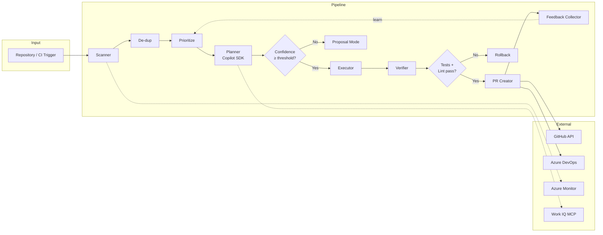

### Component Inventory

| Layer | Module | Responsibility |
|-------|--------|----------------|
| **CLI** | `cli/main.py` | Typer commands: `run`, `scan`, `init`, `status`, `report`, `heal`, `review-pr` |
| **Pipeline** | `pipeline.py` | Orchestrates all stages with OTel tracing |
| **Scanner** | `scanner/` | 7 scanners behind `BaseScanner` ABC + registry |
| **Planner** | `planner/` | Multi-turn Copilot SDK sessions with 7 `@define_tool` functions |
| **Executor** | `executor/` | Atomic file edits, backup/rollback, git branching |
| **Verifier** | `verifier/` | pytest runner, ruff/mypy linter, Bandit/SARIF security |
| **MCP** | `mcp/` | FastMCP v2 server: 9 tools, 7 resources, 4 prompts |
| **Enterprise** | `enterprise/` | RBAC, budgets, SLA, audit, multi-tenant, approvals, secrets |
| **Intelligence** | `intelligence/` | Business impact scoring, dynamic reprioritization |
| **Feedback** | `feedback/` | PR outcome tracking, preference learning, pattern recognition |
| **Integrations** | `integrations/` | GitHub, Azure DevOps, Azure Monitor, Work IQ MCP |

---

## 2. Pipeline Architecture

**Module:** `src/codecustodian/pipeline.py`

The `Pipeline` class is the central orchestrator. It coordinates all stages
within a single OTel root span for end-to-end distributed tracing.

### Stage Flow

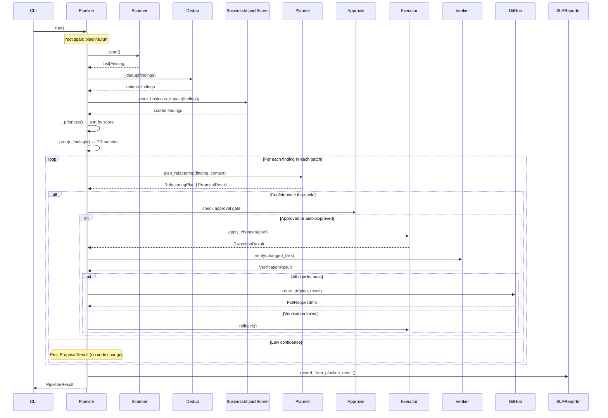

### PR Sizing & Batching (BR-PLN-002)

Findings are grouped by directory proximity via `_group_findings()`:

1. **Directory grouping** — findings in the same parent directory land in one batch
2. **Size limits** — `max_files_per_pr` (default 5) splits oversized batches
3. **Run cap** — `max_prs_per_run` (default 5) limits total PRs per execution

### Cost Savings Estimation

Built-in effort model per finding type:

| Finding Type | Manual Hours | Automated (~5 min) |
|---|---|---|
| `deprecated_api` | 2.0h | 0.08h |
| `todo_comment` | 0.5h | 0.08h |
| `code_smell` | 1.5h | 0.08h |
| `security` | 3.0h | 0.08h |
| `missing_type_hints` | 0.25h | 0.08h |

Formula: `savings_usd = max(manual_hours − automated_hours, 0) × $85/hr`

---

## 3. Scanner Subsystem

**Module:** `src/codecustodian/scanner/`

### Architecture

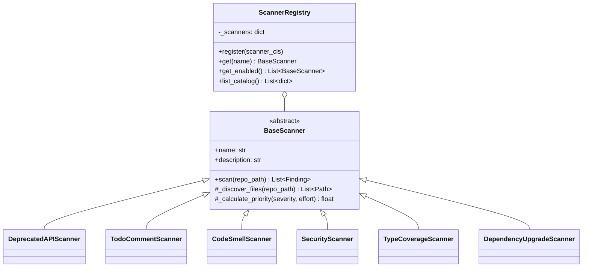

### Scanner Details

| Scanner | AST-Based | Data Source | Key Feature |
|---------|-----------|-------------|-------------|
| **DeprecatedAPIScanner** | Yes | `data/deprecations_python.json` + custom rules DSL | Pattern matching with replacement suggestions |
| **TodoCommentScanner** | No (regex) | Source comments | Age tracking, multi-language (py, go, cs, js, ts, java) |
| **CodeSmellScanner** | Yes | AST visitors | Cyclomatic complexity, nesting depth, function length |
| **SecurityScanner** | Yes (regex+AST) | Patterns + Bandit | Hardcoded secrets, SQL injection, command injection |
| **TypeCoverageScanner** | Yes | AST + Copilot SDK | AI-powered type suggestions via `_suggest_types_with_copilot_async` |
| **DependencyUpgradeScanner** | No | `requirements.txt`, `pyproject.toml`, lockfiles | Version pinning detection, lockfile parsing |

### Priority Algorithm (FR-SCAN-002)

```
priority = severity_weight × (1 / effort_divisor)
```

| Severity | Weight | | Effort | Divisor |
|----------|--------|-|--------|---------|
| CRITICAL | 10.0 | | low | 1.0 |
| HIGH | 7.0 | | medium | 2.0 |
| MEDIUM | 4.0 | | high | 4.0 |
| LOW | 2.0 | | | |
| INFO | 1.0 | | | |

### File Discovery

All scanners inherit `.gitignore`-aware file discovery from `BaseScanner`:

1. Parse `.gitignore` into fnmatch patterns
2. Walk directory tree, skipping excluded paths
3. Filter by file extension per scanner configuration

---

## 4. AI Planner Subsystem (GitHub Copilot SDK)

**Module:** `src/codecustodian/planner/`

This is the core AI subsystem that leverages the **GitHub Copilot SDK**
(`copilot` PyPI package) for intelligent refactoring planning.

### SDK Integration Architecture

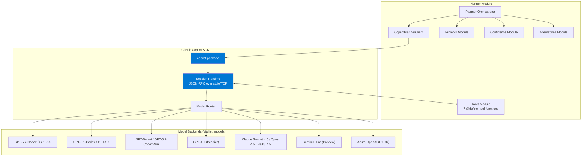

### CopilotPlannerClient (`copilot_client.py`)

The SDK wrapper managing lifecycle and model routing:

```python
class CopilotPlannerClient:
    """Wraps the Copilot SDK for planning sessions."""

    async def start()             # Initialize SDK process
    async def stop()              # Graceful shutdown
    async def create_session()    # New agentic session with tools + system prompt
    async def send_streaming()    # Turn 1: tool-assisted context gathering
    async def send_and_wait()     # Turn 2+: blocking structured output
    def select_model(finding)     # Severity-based model routing
```

**Model Routing Strategy:**

The SDK dynamically discovers available models via `list_available_models()`
(`CopilotClient.list_models()`). As of February 2026 the catalog contains
**13 models** across OpenAI, Anthropic, and Google.

The `select_model()` method picks the first available model from a ranked
preference list per strategy:

| Strategy | Preference Order (first available wins) |
|----------|------------------------------------------|
| `auto` (CRITICAL/HIGH) | `gpt-5.2-codex` → `gpt-5.1-codex` → `gpt-5.1` |
| `auto` (MEDIUM/LOW) | `gpt-5-mini` → `gpt-5.1-codex-mini` → `gpt-4.1` |
| `fast` | `gpt-5-mini` → `gpt-4.1` → `gpt-5.1-codex-mini` |
| `balanced` | `gpt-5.1-codex` → `gpt-5.1` → `claude-sonnet-4` |
| `reasoning` | `gpt-5.2-codex` → `gpt-5.1-codex-max` → `gpt-5.2` → `gpt-5.1-codex` |

**Reasoning effort** (`low` / `medium` / `high` / `xhigh`) is forwarded to
all GPT-5.x models that declare `reasoningEffort: true`:
`gpt-5.2-codex`, `gpt-5.2`, `gpt-5.1-codex-max`, `gpt-5.1-codex`,
`gpt-5.1`, `gpt-5.1-codex-mini`, `gpt-5-mini`.

> **Full Model Catalog (SDK `list_models()`):**
>
> | Model ID | Provider | Billing | Reasoning | Context Window |
> |----------|----------|---------|-----------|----------------|
> | `gpt-5.2-codex` | OpenAI | 1.0× | low/med/high/**xhigh** | 400K |
> | `gpt-5.2` | OpenAI | 1.0× | low/med/high | 264K |
> | `gpt-5.1-codex-max` | OpenAI | 1.0× | low/med/high/**xhigh** | 400K |
> | `gpt-5.1-codex` | OpenAI | 1.0× | low/med/high | 400K |
> | `gpt-5.1` | OpenAI | 1.0× | low/med/high | 264K |
> | `gpt-5.1-codex-mini` | OpenAI | 0.33× | low/med/high | 400K |
> | `gpt-5-mini` | OpenAI | **free** | low/med/high | 264K |
> | `gpt-4.1` | OpenAI | **free** | — | 128K |
> | `claude-opus-4.5` | Anthropic | 3.0× | — | 200K |
> | `claude-sonnet-4.5` | Anthropic | 1.0× | — | 200K |
> | `claude-sonnet-4` | Anthropic | 1.0× | — | 216K |
> | `claude-haiku-4.5` | Anthropic | 0.33× | — | 144K |
> | `gemini-3-pro-preview` | Google | 1.0× | — | 128K |

**Cost Tracking (`UsageAccumulator`):**

Every SDK call accumulates token usage:
- `input_tokens` / `output_tokens` — per-session running totals
- `total_cost_usd` — estimated cost based on model pricing
- Integrated with `BudgetManager` for governance

**Azure OpenAI BYOK Support:**

When configured, the SDK routes all requests through your Azure OpenAI
deployment instead of the default GitHub-hosted models:

```yaml
copilot:
  azure_openai_provider:
    base_url: "https://my-instance.openai.azure.com"
    api_key: "${AZURE_OPENAI_KEY}"  # or use Key Vault reference
    api_version: "2024-10-21"
```

### Multi-Turn Session Architecture

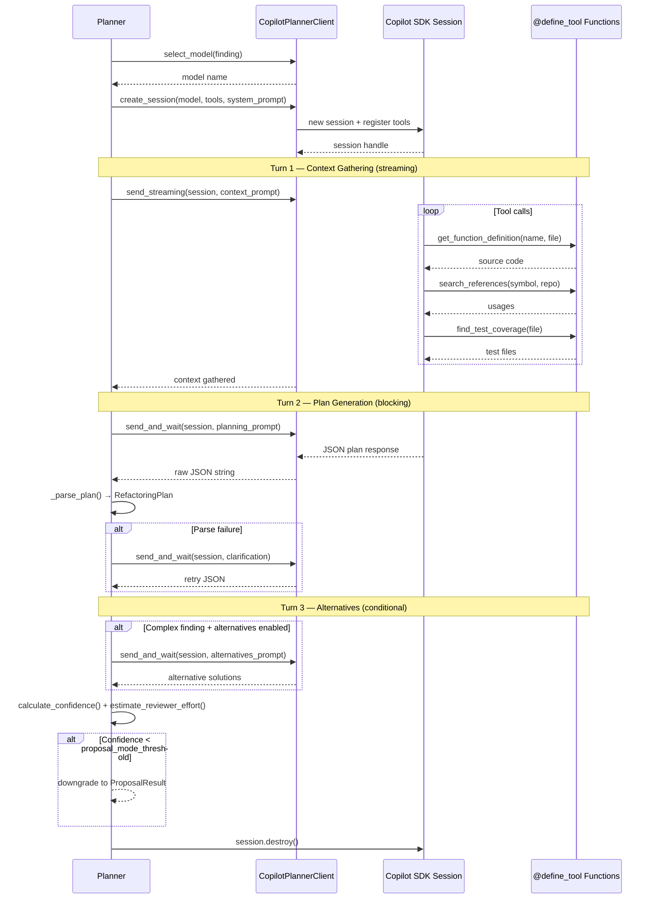

### Tool Definitions (`planner/tools.py`)

Seven `@define_tool` functions with Pydantic parameter schemas that the
Copilot SDK can call during agentic sessions:

| Tool | Parameters | Returns | Purpose |
|------|-----------|---------|---------|
| `get_function_definition` | `name`, `file_path` | Source code string | Read function/class source |
| `get_imports` | `file_path` | Import list | Analyze module dependencies |
| `search_references` | `symbol`, `repo_path` | Usage locations | Find all usages of a symbol |
| `find_test_coverage` | `file_path`, `repo_path` | Test file list | Discover covering tests |
| `get_call_sites` | `function_name`, `repo_path` | Call locations | Trace function callers |
| `check_type_hints` | `file_path` | Coverage stats | Audit type annotation completeness |
| `get_git_history` | `file_path`, `max_commits` | Commit history | Determine change frequency |

**Fallback Mechanism:** When the `copilot` package is not installed, a
`@sdk_fallback` decorator provides stub implementations that return
"SDK not available" messages, ensuring the planner degrades gracefully.

### Confidence Scoring

Post-plan confidence is computed by `calculate_confidence()`:

**Factors considered:**
- Number of files changed (fewer = higher confidence)
- Lines of code modified (fewer = higher)
- Whether function signatures change (signature changes lower confidence)
- Test coverage of affected files (higher coverage = higher confidence)
- Change frequency from git history (stable files = higher confidence)

**Reviewer Effort Estimation:** Maps confidence + plan complexity to
`trivial`, `small`, `moderate`, `large`, or `extensive` effort categories.

---

## 5. Executor Subsystem

**Module:** `src/codecustodian/executor/`

### Component Architecture

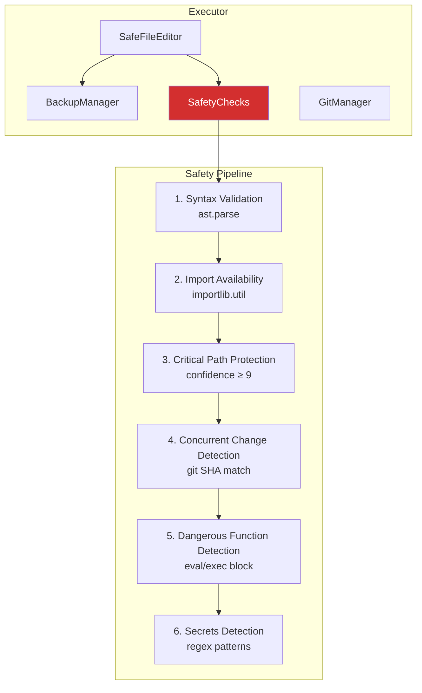

### SafeFileEditor

Atomic file modification with multi-file transaction support:

1. **Pre-validation** — file size (≤10 MB), read-only check, binary detection, encoding verification
2. **Backup** — `BackupManager.create_backup()` stores timestamped copy
3. **Syntax check** — `ast.parse()` on new content (Python files)
4. **Atomic write** — write to temp file → `os.rename()` to target
5. **Transaction** — if any file in a batch fails, all are reverted from backup

### BackupManager

- Timestamped backup directory: `.codecustodian-backups/`
- Session-based grouping for multi-file rollbacks
- Restore API for individual or batch file recovery

### SafetyChecks (FR-EXEC-101)

Six pre-execution safety checks — ALL must pass or the plan is downgraded
to proposal mode:

| Check | Detection Method | Action on Failure |
|-------|-----------------|-------------------|
| Syntax validation | `ast.parse()` on new code | Block execution |
| Import availability | `importlib.util.find_spec()` | Block execution |
| Critical path protection | File path pattern matching | Require confidence ≥ 9 |
| Concurrent change detection | Git blob SHA comparison | Abort (stale) |
| Dangerous function detection | AST check for `eval`/`exec` | Block execution |
| Secrets detection | Regex: API keys, tokens, passwords, AWS keys, GitHub PATs | Block execution |

**Critical file patterns:** `main.py`, `__init__.py`, `app.py`, `wsgi.py`,
`asgi.py`, `manage.py`, `conftest.py`

**Critical directory patterns:** `api/`, `routes/`, `endpoints/`, `auth/`,
`middleware/`

### GitManager

Manages the git workflow for refactoring PRs:

| Operation | Implementation |
|-----------|---------------|
| Branch creation | `tech-debt/{category}-{file}-{timestamp}` naming convention |
| Stash/pop | Save/restore working tree before branch switch |
| Commit | Conventional commit messages: `refactor(scanner): ...` |
| Push | Push to remote with upstream tracking |
| SHA tracking | Blob SHA comparison for concurrent change detection |
| Remote parsing | HTTPS and SSH GitHub URL parsing via regex |

---

## 6. Verifier Subsystem

**Module:** `src/codecustodian/verifier/`

### Architecture

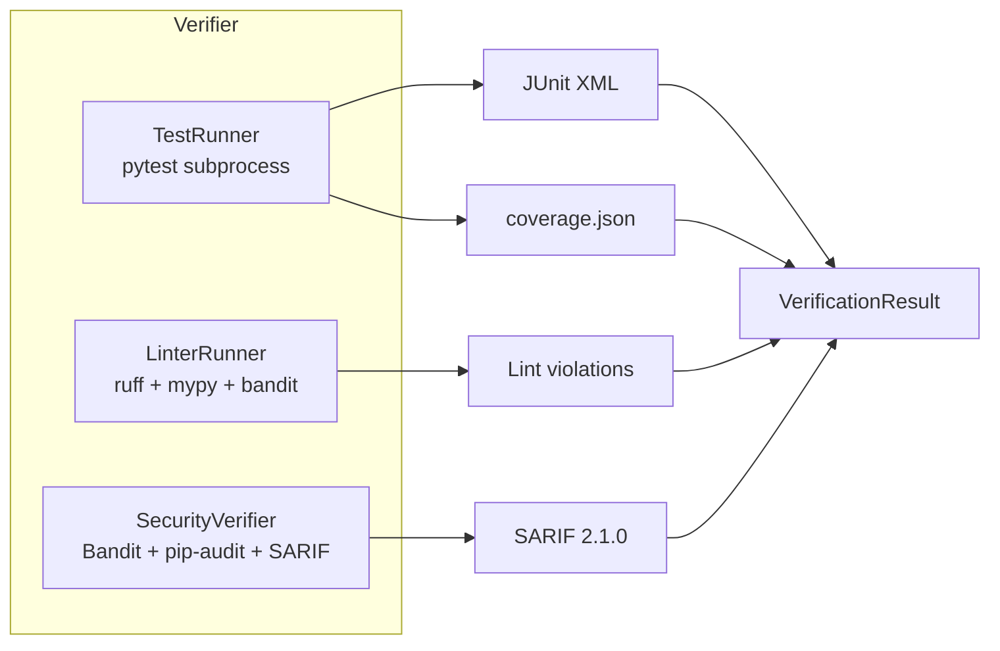

### TestRunner

- **Framework:** pytest via `subprocess.run` (process isolation)
- **Coverage:** `pytest-cov` with JSON output for delta calculation
- **Workers:** `pytest-xdist` parallel execution (configurable)
- **Test discovery:** maps changed files → `tests/test_{name}.py` and test directories
- **Baseline comparison:** pre-existing failures ignored (FR-VERIFY-100)
- **Output:** JUnit XML + coverage JSON → `VerificationResult`

### LinterRunner

Three linters run on changed files with baseline comparison:

| Linter | Purpose | Output Format |
|--------|---------|---------------|
| **ruff** | Python linting (fast) | JSON |
| **mypy** | Type checking | JSON |
| **bandit** | Security patterns | JSON |

**Baseline comparison:** `filter_new_violations()` matches by `(file, line, code, tool)`
tuple, reporting only violations introduced by the change.

### SecurityVerifier

- **Bandit analysis** on changed Python files
- **Dependency scanning** via `pip-audit` with vulnerability matching
- **SARIF 2.1.0 report generation** for GitHub Security tab integration
- Blocks if any HIGH severity issue is found

---

## 7. MCP Server Architecture (FastMCP v2)

**Module:** `src/codecustodian/mcp/`

### Server Architecture

```mermaid
graph TB
    subgraph "MCP Server (FastMCP v2)"
        S[FastMCP Server<br/>name='codecustodian']
        H[/health endpoint]

        subgraph Tools["8 Tools"]
            T1[scan_repository]
            T2[list_scanners]
            T3[plan_refactoring]
            T4[apply_refactoring]
            T5[verify_changes]
            T6[create_pull_request]
            T7[calculate_roi]
            T8[get_business_impact]
        end

        subgraph Resources["7 Resources"]
            R1["codecustodian://config"]
            R2["codecustodian://version"]
            R3["codecustodian://scanners"]
            R4["findings://{repo}/all"]
            R5["findings://{repo}/{type}"]
            R6["config://settings"]
            R7["dashboard://{team}/summary"]
        end

        subgraph Prompts["4 Prompts"]
            P1[refactor_finding]
            P2[scan_summary]
            P3[roi_report]
            P4[onboard_repo]
        end
    end

    subgraph Transports
        ST[stdio]
        HTTP[Streamable HTTP<br/>:8080]
    end

    subgraph Clients
        C1[VS Code Copilot]
        C2[Claude Desktop]
        C3[Any MCP Client]
    end

    C1 --> ST
    C2 --> ST
    C3 --> HTTP
    ST --> S
    HTTP --> S
    S --> H
    S --> Tools
    S --> Resources
    S --> Prompts

    style S fill:#0078d4,color:#fff
```

### mcp.json Configuration

```json
{
  "servers": {
    "codecustodian": {
      "type": "stdio",
      "command": "python",
      "args": ["-m", "codecustodian.mcp"]
    },
    "work-iq": {
      "type": "stdio",
      "command": "npx",
      "args": ["@anthropic-ai/mcp-server-work-iq"]
    }
  }
}
```

### Tool Details

| Tool | Parameters | Uses `Context` | Purpose |
|------|-----------|---------------|---------|
| `scan_repository` | `repo_path`, `scanners?` | Yes (progress) | Full scan with progress reporting |
| `list_scanners` | — | No | Catalog of available scanners |
| `plan_refactoring` | `finding_id` | Yes | AI planning via Copilot SDK |
| `apply_refactoring` | `plan_id` | Yes | Execute plan with safety checks |
| `verify_changes` | `changed_files` | Yes | Run tests + lint + security |
| `create_pull_request` | `plan_id`, `verification` | No | Create GitHub PR |
| `calculate_roi` | `team?`, `period?` | No | ROI report generation |
| `get_business_impact` | `finding_id` | No | Business impact score |

All tools use `ToolAnnotations` for metadata and `Context` for progress
reporting via MCP progress tokens.

### Resource Architecture

**Static resources** — return fixed data:
- `codecustodian://config` — default YAML configuration
- `codecustodian://version` — package version
- `codecustodian://scanners` — scanner catalog

**Dynamic resources (URI templates)** — return scan-dependent data:
- `findings://{repo_name}/all` — all cached findings as JSON
- `findings://{repo_name}/{finding_type}` — filtered by type
- `config://settings` — active config (loaded from `.codecustodian.yml`)
- `dashboard://{team_name}/summary` — team dashboard with counts by severity/type

### Prompt Templates

| Prompt | Parameters | Use Case |
|--------|-----------|----------|
| `refactor_finding` | `finding_type`, `file_path`, `line`, `description` | Analyze and fix a specific finding |
| `scan_summary` | `total_findings`, `repo_name` | Prioritize scan results |
| `roi_report` | `team_name`, `period` | Generate ROI analysis |
| `onboard_repo` | `repo_url`, `language` | Onboard a new repository |

### Cache Layer

`mcp/cache.py` provides `scan_cache` — an in-memory cache that stores
scan results between tool calls, enabling resources to serve findings
without re-scanning.

---

## 8. Work IQ MCP Integration

**Module:** `src/codecustodian/integrations/work_iq.py`

### Architecture

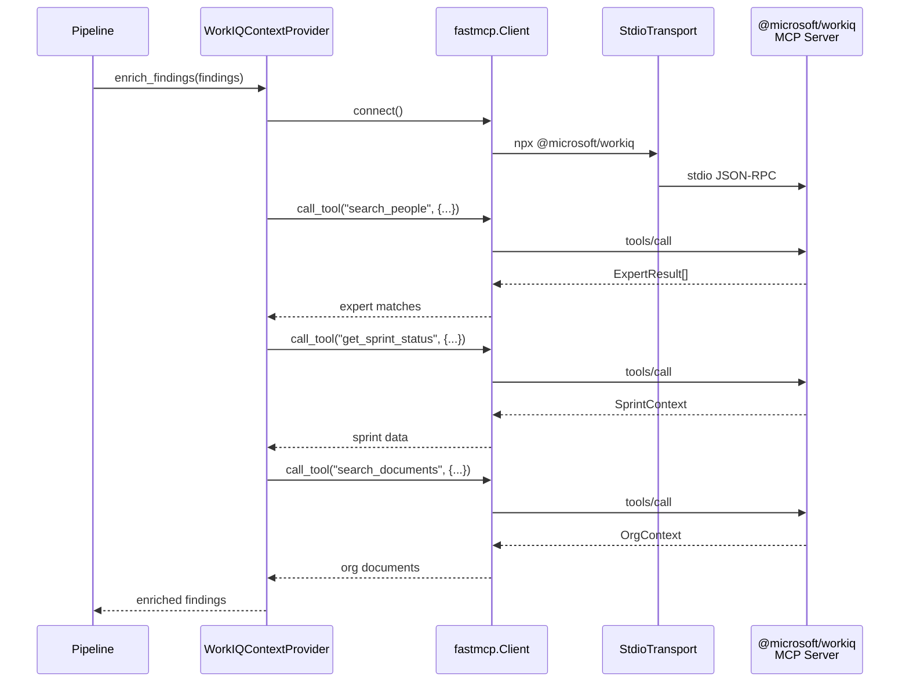

### Provider Design

```python
class WorkIQContextProvider:
    """MCP client → Work IQ server via fastmcp.Client + StdioTransport."""

    async def get_expert_for_finding(finding) → ExpertResult
    async def get_sprint_context(team) → SprintContext
    async def get_org_context(query) → OrgContext
```

### Data Models

| Model | Fields | Purpose |
|-------|--------|---------|
| `ExpertResult` | `name`, `email`, `expertise_areas`, `confidence` | Best assignee for a finding |
| `SprintContext` | `sprint_name`, `capacity_pct`, `blocked_items` | Sprint-aware scheduling |
| `OrgContext` | `documents`, `policies`, `related_projects` | Organizational knowledge |

### WorkItemIntelligence

Bridges Work IQ data with Azure DevOps for priority sorting:
- Matches findings to blocked work items
- Adjusts priority based on sprint capacity
- Routes to domain experts for review assignment

---

## 9. Enterprise Subsystem

**Module:** `src/codecustodian/enterprise/`

### Component Map

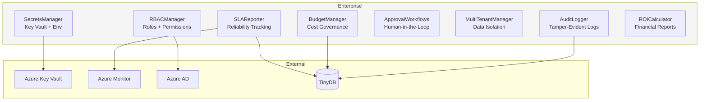

### RBAC (FR-SEC-101, FR-SEC-102)

**Roles:** `ADMIN`, `SECURITY_ADMIN`, `TEAM_LEAD`, `CONTRIBUTOR`, `DEVELOPER`, `VIEWER`

**Permissions:** `SCAN`, `PLAN`, `EXECUTE`, `CREATE_PR`, `CONFIGURE`,
`VIEW_REPORTS`, `OVERRIDE_SECURITY`, `VIEW_AUDIT_LOGS`, `APPROVE_PLANS`, `APPROVE_PRS`

**Authentication:** `UserContext` created from Azure AD JWT claims or static
configuration. Supports `tenant_id` and `scoped_repos` for multi-tenant
isolation.

Default policy matrix:

| Role | Key Permissions |
|------|----------------|
| ADMIN | All permissions |
| SECURITY_ADMIN | SCAN, PLAN, VIEW_REPORTS, OVERRIDE_SECURITY, VIEW_AUDIT_LOGS |
| TEAM_LEAD | SCAN, PLAN, EXECUTE, CREATE_PR, VIEW_REPORTS, APPROVE_PLANS |
| CONTRIBUTOR | SCAN, PLAN, EXECUTE, CREATE_PR |
| DEVELOPER | SCAN, PLAN, VIEW_REPORTS |
| VIEWER | VIEW_REPORTS |

### BudgetManager (FR-COST-100, FR-COST-101)

Tracks and enforces AI operation spending:

| Feature | Implementation |
|---------|---------------|
| Per-operation cost recording | `CostEntry` with tokens_in/out, model, operation type |
| Monthly limits | Configurable `monthly_budget` with hard enforcement |
| Threshold alerts | `BudgetAlert` at 50%, 75%, 90%, 100% thresholds |
| Cost persistence | JSONL file for historical trend analysis |
| Per-run tracking | `run_id` correlation for cost attribution |

**Cost model:** Records `tokens_in`, `tokens_out`, `model`, and `cost_usd`
for every `plan`, `execute`, `verify`, and `scan` operation.

### SLAReporter (BR-ENT-002)

```python
class SLAReport(BaseModel):
    total_runs: int
    successful_runs: int
    success_rate: float
    avg_duration_seconds: float
    p95_duration_seconds: float
    avg_time_to_pr_seconds: float
    top_failure_reasons: list[dict]
    failure_trend: str  # "improving" | "stable" | "degrading"
    alert: str
```

- **Storage:** TinyDB-backed `sla.json`
- **Metrics forwarded:** to Azure Monitor via `ObservabilityProvider`
- **Failure spike detection:** configurable threshold (default 10%) with auto-alerting
- **Export:** CSV and Markdown reports

### AuditLogger

Append-only compliance logging:

- **Format:** JSONL with SHA-256 tamper-evident hashes per entry
- **Fields:** `event_type`, `action`, `finding_id`, `file_path`, `actor`,
  `ai_reasoning`, `confidence_score`, `verification`, `pr_number`
- **Hash computation:** `hashlib.sha256` over JSON-serialized entry (excluding hash field)
- **Sinks:** local JSONL, Azure Monitor, Azure Blob Storage

### ApprovalWorkflows (BR-GOV-001, BR-GOV-002)

| State | Description |
|-------|-------------|
| `PENDING` | Awaiting human review |
| `APPROVED` | Explicitly approved |
| `REJECTED` | Explicitly rejected |
| `AUTO_APPROVED` | Met auto-approval criteria |
| `EXPIRED` | TTL exceeded without action |

**Auto-approval rules:**
- Confidence ≥ threshold AND no sensitive path AND risk = LOW

**Sensitive path detection:** configurable glob patterns for paths requiring
explicit approval.

### MultiTenantManager (FR-SEC-102)

Tenant-scoped data isolation:

```
.codecustodian-data/<tenant_id>/
├── audit/
├── costs/
├── roi/
└── feedback/
```

Each tenant has:
- `TenantConfig`: `display_name`, `allowed_repos`, `monthly_budget`, `max_prs_per_run`, `require_approval`
- Fully isolated data directories
- Independent budget and SLA tracking

### SecretsManager (FR-SEC-101)

Dual-mode secret retrieval:

| Mode | Condition | Implementation |
|------|-----------|---------------|
| **Azure Key Vault** | `vault_name` configured | `DefaultAzureCredential` → `SecretClient` |
| **Environment** | No vault configured | `os.environ` lookup |

Features:
- Rotation age monitoring with configurable warning threshold (default 90 days)
- Audit logging of all secret access (values never logged)
- Lazy client initialization

---

## 10. Intelligence Subsystem

**Module:** `src/codecustodian/intelligence/`

### BusinessImpactScorer (FR-PRIORITY-100)

5-factor scoring model:

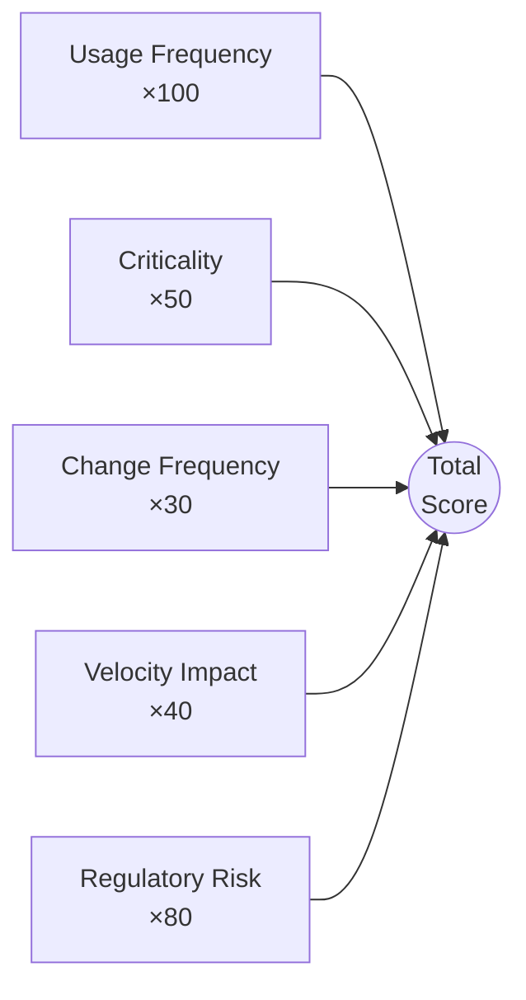

| Factor | Weight | Data Source |
|--------|--------|-------------|
| **Usage frequency** | 100 | Telemetry-based call counts (`CodeContext`) |
| **Criticality** | 50 | Critical-path detection (payments, auth, security keywords) |
| **Change frequency** | 30 | Git history churn rate |
| **Velocity impact** | 40 | Azure DevOps blocked work items |
| **Regulatory risk** | 80 | PII / GDPR / HIPAA annotations |

Formula:
$$\text{Score} = (U \times 100) + (C \times 50) + (CF \times 30) + (VI \times 40) + (RR \times 80)$$

Weights are configurable via `ScoringWeights` Pydantic model and
`.codecustodian.yml`.

### DynamicReprioritizer

Event-driven priority adjustments triggered by:
- Production incidents → boost affected file findings
- New CVE announcements → boost security findings
- Sprint deadline proximity → boost velocity-impacting findings
- Budget changes → reorder by cost-effectiveness

---

## 11. Feedback & Learning Subsystem

**Module:** `src/codecustodian/feedback/`

### Architecture

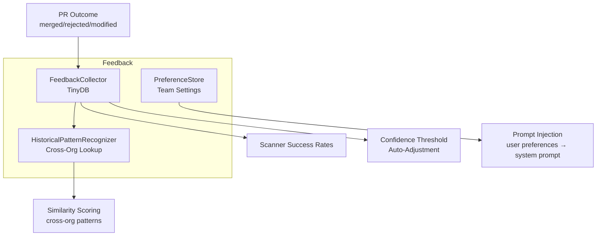

### FeedbackCollector

- **Storage:** TinyDB-backed for lightweight persistence
- **Tracking:** PR outcomes — `merged`, `rejected`, `modified`
- **Scanner rates:** per-scanner success/failure rates with rolling averages
- **Confidence calibration:** auto-adjusts confidence thresholds based on
  historical accuracy

### PreferenceStore

Stores team and user coding preferences:
- Code style preferences (naming, formatting)
- Review preferences (draft vs. ready, label preferences)
- Framework-specific conventions
- **Prompt injection:** preferences are inserted into the Copilot SDK system
  prompt for personalized planning

### HistoricalPatternRecognizer

Cross-organization pattern matching:
- Indexes past refactoring patterns by finding type and code structure
- Similarity scoring between new findings and historical solutions
- Surfaces proven refactoring approaches from other repositories

---

## 12. Integrations Layer

**Module:** `src/codecustodian/integrations/`

### GitHub Integration

**SDK:** PyGithub + GitPython

| Feature | Implementation |
|---------|---------------|
| PR creation | `PyGithub` → `create_pull()` with labels, reviewers, draft flag |
| PR comments | Inline review comments on specific lines |
| Issue creation | Auto-created issues for findings below confidence threshold |
| Branch management | `GitPython` → branch creation, commits, push |

### Azure DevOps Integration

**SDK:** `httpx.AsyncClient` → Azure DevOps REST API

```python
class AzureDevOpsClient:
    """Async REST client for Azure DevOps work items."""

    async def create_work_item(finding, plan) → dict
    async def update_work_item(id, fields) → dict
```

| Feature | Implementation |
|---------|---------------|
| Work item creation | JSON Patch operations via REST API |
| Severity → priority mapping | CRITICAL→1, HIGH→2, MEDIUM→3, LOW→4 |
| Tech-debt tagging | Auto-applied tags for filtering |
| Board integration | Links work items to findings and PRs |

### Azure Monitor Integration

**SDK:** `azure-monitor-opentelemetry` (OpenTelemetry distro)

```python
class ObservabilityProvider:
    """One-liner Azure Monitor setup via configure_azure_monitor()."""

    configure()          # Initialize OTel with Azure Monitor exporter
    record_metric()      # Custom counters and histograms
    record_trace()       # Custom spans
```

| Telemetry Type | Examples |
|---------------|---------|
| **Traces** | Pipeline spans, scanner spans, planner spans |
| **Metrics** | `findings_count`, `pr_created`, `duration_seconds`, `cost_usd` |
| **Logs** | Structured JSON logs via `codecustodian.logging.get_logger()` |

Graceful fallback when Azure SDK is not installed — metrics are logged
locally instead.

---

## 13. Configuration Architecture

**File:** `.codecustodian.yml` → **Schema:** `src/codecustodian/config/schema.py`

### Hierarchy

```
Organization defaults → Team overrides → Repository .codecustodian.yml → CLI flags
```

### Configuration Sections

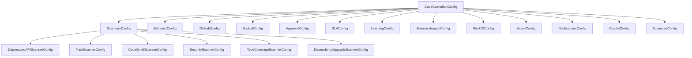

### Key Configuration Models

| Section | Key Fields |
|---------|-----------|
| `scanners.deprecated_apis` | `enabled`, `severity`, `libraries`, `custom_patterns`, `exclude` |
| `scanners.todo_comments` | `enabled`, `max_age_days`, `patterns`, `auto_issue`, `languages` |
| `scanners.code_smells` | `cyclomatic_complexity`, `function_length`, `nesting_depth` |
| `scanners.type_coverage` | `target_coverage`, `ai_suggest_types`, `ai_max_suggestions_per_scan` |
| `scanners.dependency_upgrades` | `tracked_files` (requirements, pyproject, lockfiles) |
| `behavior` | `max_prs_per_run`, `confidence_threshold`, `proposal_mode_threshold`, `auto_split_prs` |
| `github` | `repo_name`, `pr_labels`, `reviewers`, `base_branch`, `draft_threshold` |
| `budget` | `monthly_budget`, `alerts` |
| `copilot` | `model_strategy`, `azure_openai` (BYOK), `enable_alternatives` |
| `work_iq` | `enabled`, command, args |

### Validation

All configuration uses Pydantic v2 with:
- `@field_validator` for range/format checks
- `@model_validator(mode="after")` for cross-field consistency
  (e.g., `proposal_mode_threshold ≤ confidence_threshold`)
- `ConfigDict(validate_assignment=True)` for runtime mutation safety

---

## 14. Data Model Reference

**Module:** `src/codecustodian/models.py`

All models use Pydantic v2 with `@computed_field`, `@field_validator`,
and `@model_validator`.

### Core Models

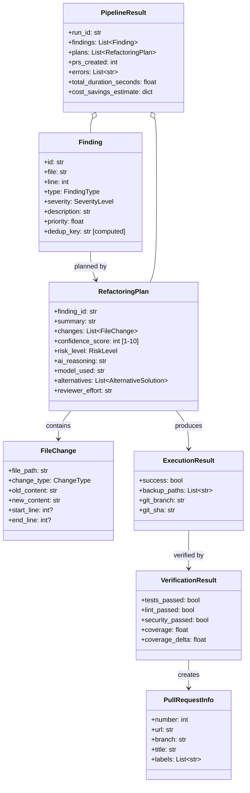

### Enums

| Enum | Values |
|------|--------|
| `SeverityLevel` | CRITICAL, HIGH, MEDIUM, LOW, INFO |
| `FindingType` | DEPRECATED_API, TODO_COMMENT, CODE_SMELL, SECURITY, TYPE_COVERAGE, DEPENDENCY_UPGRADE |
| `ChangeType` | REPLACE, INSERT, DELETE, RENAME |
| `PipelineStage` | ONBOARD, SCAN, DEDUP, PRIORITIZE, PLAN, EXECUTE, VERIFY, PR, FEEDBACK |
| `RiskLevel` | LOW, MEDIUM, HIGH |

---

## 15. Deployment Architecture (Azure)

**Infrastructure:** `infra/main.bicep` + 8 Bicep modules

### Azure Resource Topology

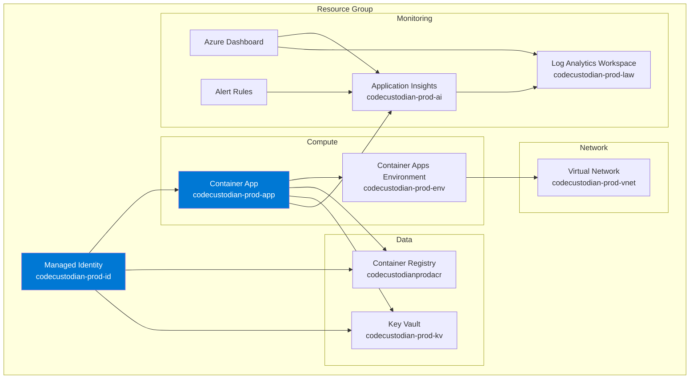

### Bicep Module Inventory

| Module | Resources Created | Purpose |
|--------|------------------|---------|
| `identity.bicep` | Managed Identity | Zero-secret authentication |
| `network.bicep` | VNet + subnets | Network isolation |
| `monitor.bicep` | Log Analytics + App Insights | Observability |
| `dashboard.bicep` | Azure Dashboard | Operational visibility |
| `alerts.bicep` | Alert rules | Proactive monitoring |
| `acr.bicep` | Container Registry | Image storage with RBAC |
| `keyvault.bicep` | Key Vault | Secret management |
| `container-app.bicep` | Container Apps Env + App | Runtime hosting |

### Container Configuration

- **Image:** pulled from Azure Container Registry using Managed Identity
- **Transport:** Streamable HTTP on port 8080 for MCP server
- **Secrets:** injected from Key Vault via Managed Identity
- **Scaling:** Container Apps auto-scaling based on HTTP traffic

### Deployment Flow

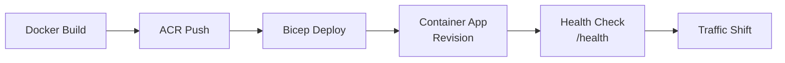

---

## 16. Security Architecture

### Defense-in-Depth Layers

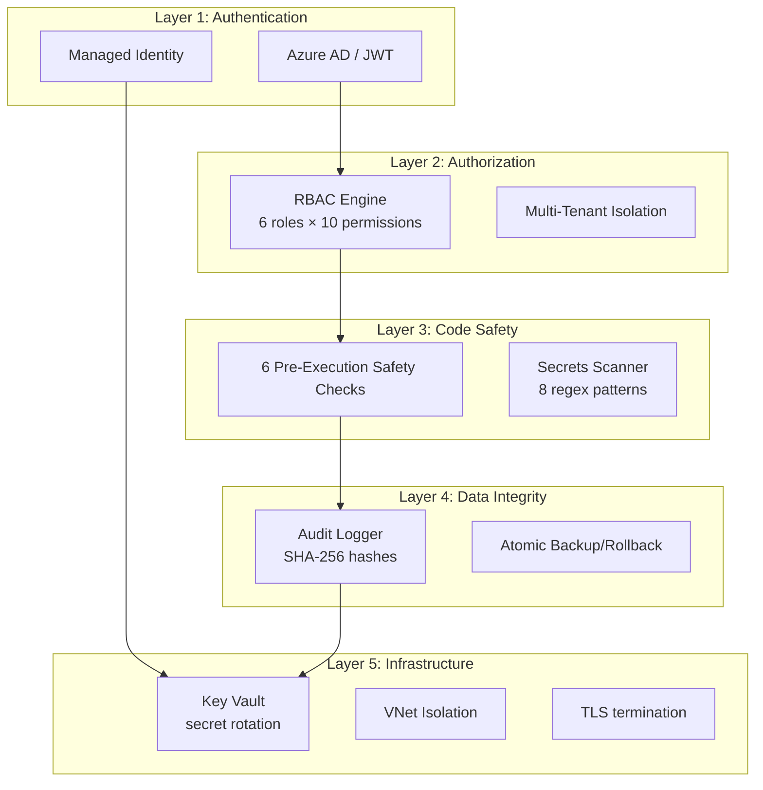

### Secrets Detection Patterns

The safety system blocks code containing:

| Pattern | Regex | Example Blocked |
|---------|-------|-----------------|
| API keys | `api[_-]?key\s*[:=]\s*['"][A-Za-z0-9_\-]{16,}['"]` | `api_key = "abc123..."` |
| Passwords | `(?:secret\|password\|passwd)\s*[:=]` | `password = "hunter2"` |
| Tokens | `(?:token\|bearer)\s*[:=]\s*['"][A-Za-z0-9...]{16,}` | `token = "eyJ..."` |
| AWS keys | `AWS_SECRET_ACCESS_KEY\s*[:=]` | `AWS_SECRET_ACCESS_KEY = "..."` |
| Private keys | `PRIVATE[_-]?KEY.*-----BEGIN` | PEM key content |
| GitHub PATs | `ghp_[A-Za-z0-9]{36}` | `ghp_abc123...` |
| OpenAI keys | `sk-[A-Za-z0-9]{32,}` | `sk-abc123...` |

### Audit Trail

Every operation produces a tamper-evident `AuditEntry`:

```json
{
  "timestamp": "2025-01-15T10:30:00Z",
  "event_type": "refactoring_action",
  "action": "apply_plan",
  "finding_id": "f_abc123",
  "file_path": "src/api.py",
  "actor": "codecustodian",
  "ai_reasoning": "Replace deprecated API call...",
  "confidence_score": 8,
  "verification": {
    "tests_passed": true,
    "linting_passed": true,
    "security_passed": true
  },
  "pr_number": 42,
  "entry_hash": "sha256:a1b2c3..."
}
```

---

## 17. Observability Architecture

### Telemetry Flow

```mermaid
graph LR
    subgraph Application
        OT[OpenTelemetry SDK]
        TRACER[Tracer:<br/>codecustodian.pipeline]
        METER[Meters:<br/>custom counters/histograms]
        LOG[Structured Logger:<br/>get_logger()]
    end

    subgraph Export
        AZMON[Azure Monitor<br/>Exporter]
        CONSOLE[Console<br/>Exporter]
    end

    subgraph Azure
        AI2[Application Insights]
        LAW2[Log Analytics]
        DASH2[Dashboard]
        ALERTS[Alert Rules]
    end

    TRACER --> OT
    METER --> OT
    LOG --> OT
    OT --> AZMON
    OT --> CONSOLE
    AZMON --> AI2
    AI2 --> LAW2
    LAW2 --> DASH2
    LAW2 --> ALERTS
```

### Span Hierarchy

```
pipeline.run (root)
├── pipeline.scan
│   ├── pipeline.scan.deprecated_api
│   ├── pipeline.scan.todo_comments
│   ├── pipeline.scan.code_smells
│   ├── pipeline.scan.security
│   ├── pipeline.scan.type_coverage
│   └── pipeline.scan.dependency_upgrades
├── pipeline.dedup
├── pipeline.prioritize
├── pipeline.plan.{finding_id}
├── pipeline.execute.{finding_id}
├── pipeline.verify.{finding_id}
└── pipeline.pr.{finding_id}
```

### Key Span Attributes

| Attribute | Example | Scope |
|-----------|---------|-------|
| `pipeline.run_id` | `uuid4` | Root span |
| `pipeline.repo_path` | `/path/to/repo` | Root span |
| `pipeline.dry_run` | `true/false` | Root span |
| `scanner.name` | `deprecated_api` | Scanner spans |
| `pipeline.findings_count` | `42` | Root span (end) |
| `pipeline.prs_created` | `3` | Root span (end) |
| `pipeline.duration_seconds` | `45.2` | Root span (end) |

---

## 18. SDK Integration Map

### Complete SDK Dependency Graph

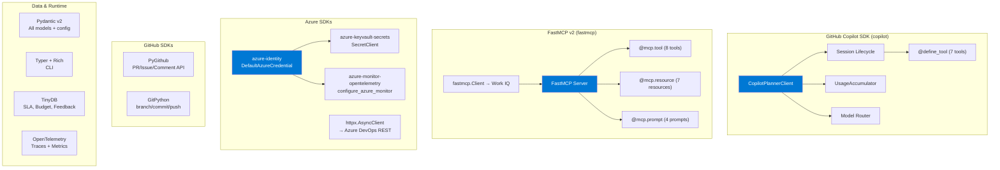

### SDK Usage Summary

| SDK | Package | Version | Where Used | How Used |
|-----|---------|---------|-----------|----------|
| **Copilot SDK** | `copilot` | ≥0.1.29 | `planner/copilot_client.py`, `planner/tools.py` | Session lifecycle, model routing, `@define_tool`, cost tracking, BYOK |
| **FastMCP** | `fastmcp` | ≥2.14.0,<3 | `mcp/server.py`, `mcp/tools.py`, `mcp/resources.py`, `mcp/prompts.py`, `integrations/work_iq.py` | Server (tools/resources/prompts), Client (Work IQ MCP) |
| **PyGithub** | `PyGithub` | latest | `integrations/github.py`, `cli/main.py` | PR creation, comments, issues, labels |
| **GitPython** | `gitpython` | latest | `executor/git_manager.py` | Branch ops, commits, push, SHA tracking |
| **Azure Identity** | `azure-identity` | ≥1.15 | `enterprise/secrets_manager.py` | `DefaultAzureCredential` for Key Vault + MI |
| **Azure Key Vault** | `azure-keyvault-secrets` | ≥4.7 | `enterprise/secrets_manager.py` | `SecretClient` → get/set/list secrets |
| **Azure Monitor** | `azure-monitor-opentelemetry` | ≥1.2 | `integrations/azure_monitor.py` | `configure_azure_monitor()` one-liner setup |
| **Azure DevOps** | `azure-devops` + `httpx` | ≥7.1 | `integrations/azure_devops.py` | REST API for work items |
| **Pydantic** | `pydantic` | ≥2.5 | All modules | Models, config schema, validation |
| **OpenTelemetry** | `opentelemetry-api` | latest | `pipeline.py` | Distributed tracing spans |
| **TinyDB** | `tinydb` | latest | `enterprise/sla_reporter.py`, `enterprise/budget_manager.py`, `feedback/` | Lightweight JSON DB |
| **Typer** | `typer` | latest | `cli/main.py` | CLI framework |
| **Rich** | `rich` | latest | `cli/main.py` | Console output formatting |

---

## 19. Planned Architecture Extensions

> Business-approved features organized by implementation phase. Each
> extension lists the architecture layers affected, new modules required,
> SDK integration points, and data model additions.

### 19.1 Feasibility Triage Summary

| # | Feature | Feasible | Effort | Phase | Layers Affected |
|---|---------|:--------:|--------|-------|-----------------|
| 1 | Autonomous SRE (Prod→Code Loop) | **Yes** | High | 12 | Pipeline, Verifier, Integrations (Azure Monitor), MCP |
| 2 | Predictive Debt Forecasting + Dashboard | **Yes** | Medium–High | 12 | Intelligence, Enterprise (SLA), MCP, Azure Monitor |
| 3 | Blast Radius Analysis | **✅ Done** | Medium | 12 | Intelligence, Executor (Safety), Planner, MCP |
| 4 | Architectural Drift Detection | **✅ Done** | Medium | 12 | Scanner, Config, MCP |
| 5 | Zero-Friction Onboarding Enhancement | **Yes** | Low | 12 | Onboarding, CLI, Config |
| 6 | AI Test Synthesis | **Yes** | Medium–High | 13 | Planner, Verifier, Executor |
| 7 | Agentic Migrations | **Yes** | High | 13 | Intelligence, Planner, Pipeline, MCP |
| 8 | ChatOps (Teams/Slack) | **Yes** | Medium | 13 | Integrations, Enterprise (Approval), MCP |
| 9 | Codebase Knowledge Graph (GraphRAG) | **Yes** (partial) | High | 14 | Intelligence, Planner (Tools), MCP |
| 10 | AI Slop Detector | **Yes** | Medium | 14 | Scanner, Config |
| 11 | Multi-Agent Swarm / Pipeline | **No** (deferred) | Very High | — | Requires fundamental pipeline refactoring |

---

### 19.2 Autonomous SRE — Production-to-Code Feedback Loop

**Phase:** 12 | **Effort:** High | **New modules:** 3

#### Architecture

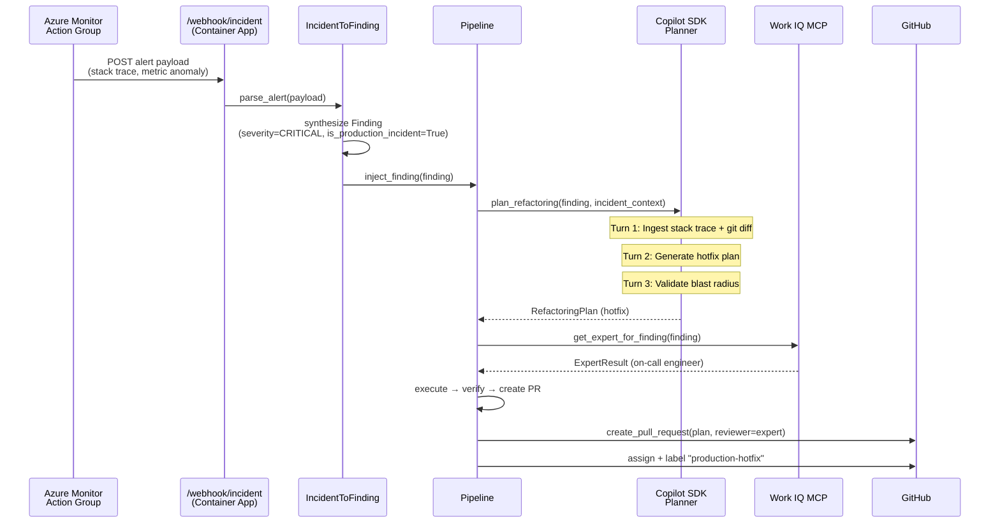

#### New Modules

| Module | Location | Purpose |
|--------|----------|---------|
| `IncidentWebhookHandler` | `mcp/incident_webhook.py` | FastAPI endpoint receiving Azure Monitor webhooks with HMAC validation |
| `IncidentToFinding` | `intelligence/incident_converter.py` | Parses alert payloads (stack traces, metric anomalies) → `Finding` with `is_production_incident=True` |
| `IncidentResponsePolicy` | `enterprise/incident_policy.py` | Configurable auto-bypass of approval gates for CRITICAL incidents, rate limiting |

#### Data Model Additions

```python
class IncidentAlert(BaseModel):
    """Parsed Azure Monitor alert payload."""
    alert_id: str
    severity: SeverityLevel  # mapped from Azure severity
    stack_trace: str | None
    metric_name: str | None
    metric_value: float | None
    affected_resource: str
    timestamp: datetime
    recent_deployments: list[str]  # git SHAs from recent PRs

class IncidentResponseResult(BaseModel):
    """Outcome of autonomous incident response."""
    alert_id: str
    finding_id: str
    root_cause_commit: str | None
    hotfix_plan_id: str | None
    pr_number: int | None
    response_time_seconds: float
    action_taken: str  # "hotfix_pr" | "revert_pr" | "proposal_only" | "escalated"
```

#### Configuration

```yaml
autonomous_sre:
  enabled: false  # opt-in
  webhook_secret: "${INCIDENT_WEBHOOK_SECRET}"  # HMAC validation
  auto_bypass_approval: true  # skip approval for CRITICAL incidents
  max_hotfixes_per_hour: 3  # rate limit
  revert_if_clean: true  # auto-revert if single commit is isolated
  notify_channel: "teams"  # teams | slack | none
```

#### SDK Integration Points

- **Azure Monitor:** Webhook receiver for Action Group alerts
- **Copilot SDK:** Incident-specific system prompt with stack trace + git diff context
- **Work IQ:** `search_people` for on-call expert routing, `get_sprint_status` for incident awareness
- **MCP:** New `trigger_incident_response` tool for programmatic invocation

---

### 19.3 Predictive Tech Debt Forecasting + Executive Dashboard

**Phase:** 12 | **Effort:** Medium–High | **New modules:** 2

#### Architecture

```mermaid
graph TB
    subgraph "Data Collection (per pipeline run)"
        P[Pipeline] --> SS[Snapshot Recorder]
        SS --> DB[(TinyDB<br/>debt_snapshots)]
    end

    subgraph "Forecasting Engine"
        DB --> FE[PredictiveDebtForecaster]
        FE --> ES[Exponential Smoothing]
        FE --> LR[Linear Regression]
        FE --> HM[Risk Heatmap Generator]
    end

    subgraph "Outputs"
        ES --> F30[30-day forecast]
        LR --> F90[90-day forecast]
        HM --> DASH[Executive Dashboard]
        F30 --> MCP[MCP Resource<br/>dashboard://{team}/summary]
        F90 --> MCP
        DASH --> AZMON[Azure Monitor<br/>ARM Dashboard]
    end

    subgraph "Feedback Loop"
        F30 --> PRI[Priority Booster]
        PRI --> P
    end

    style FE fill:#0078d4,color:#fff
```

#### New Modules

| Module | Location | Purpose |
|--------|----------|---------|
| `PredictiveDebtForecaster` | `intelligence/forecasting.py` | Time-series analysis: exponential smoothing + linear regression on historical debt snapshots |
| `ExecutiveDashboardGenerator` | `intelligence/executive_dashboard.py` | Generates ARM-template dashboard JSON with ROI ticker, heatmaps, trend charts |

#### Data Model Additions

```python
class DebtSnapshot(BaseModel):
    """Point-in-time debt measurement stored after each pipeline run."""
    date: datetime
    repo_path: str
    finding_count: int
    by_type: dict[str, int]  # FindingType → count
    by_severity: dict[str, int]  # SeverityLevel → count
    churn_rate: float  # commits/week in scanned files
    complexity_avg: float  # mean Radon score
    coverage_pct: float  # test coverage %

class DebtForecast(BaseModel):
    """Predicted debt at a future date."""
    forecast_date: datetime
    predicted_findings: int
    predicted_by_severity: dict[str, int]
    confidence_interval: tuple[int, int]  # (low, high)
    trend: str  # "accelerating" | "stable" | "improving"
    hotspot_directories: list[str]  # top-5 predicted debt accumulation dirs
```

#### MCP Enhancements

- Enhanced `dashboard://{team}/summary` resource includes `forecast_30d`, `forecast_90d`, `hotspot_dirs`
- New `get_debt_forecast` tool: returns `DebtForecast` for a given repo + horizon
- New Azure Monitor custom metrics: `predicted_findings_30d`, `debt_velocity`, `forecast_confidence`

---

### 19.4 Blast Radius Analysis

**Phase:** 12 | **Effort:** Medium | **New modules:** 1 | **Status:** ✅ Implemented (v0.12.0)

#### Architecture

```mermaid
graph TB
    subgraph "Pre-Execution Analysis"
        PLAN[RefactoringPlan] --> BRA[BlastRadiusAnalyzer]
        BRA --> IG[Import Graph Builder<br/>AST + networkx]
        IG --> BFS[BFS Reverse Traversal]
        BFS --> BR[BlastRadiusReport]
    end

    subgraph "Safety Integration"
        BR --> SC7["Safety Check #7<br/>Blast Radius Gate"]
        SC7 -->|radius > 0.3| PROP[Downgrade to Proposal]
        SC7 -->|radius ≤ 0.3| EXEC[Proceed to Execution]
    end

    subgraph "Output"
        BR --> PR[PR Description<br/>Impact Section]
        BR --> SDK[Copilot SDK Context<br/>Turn 1 system prompt]
    end

    style BRA fill:#d32f2f,color:#fff
```

#### New Module

| Module | Location | Purpose |
|--------|----------|---------|
| `BlastRadiusAnalyzer` | `intelligence/blast_radius.py` | Builds import graph from AST, computes reverse-dependency BFS, outputs `BlastRadiusReport` |

#### Data Model Additions

```python
class BlastRadiusReport(BaseModel):
    """Impact analysis for a set of changed files."""
    changed_files: list[str]
    directly_affected: list[str]  # files importing changed files
    transitively_affected: list[str]  # 2+ hops away
    affected_tests: list[str]  # test files in the blast radius
    radius_score: float  # 0.0–1.0 (% of repo affected)
    risk_level: RiskLevel  # LOW | MEDIUM | HIGH
    recommendation: str  # "safe to proceed" | "proposal mode recommended"
```

#### Safety Check Extension

The executor's `SafetyChecks` gains a 7th check:

| Check | Detection Method | Action on Failure |
|-------|-----------------|-------------------|
| Blast radius | Import graph BFS, `radius_score > threshold` | Downgrade to proposal mode |

Default threshold: `0.3` (30% of codebase). Configurable via `behavior.blast_radius_threshold`.

---

### 19.5 Architectural Drift Detection Scanner

**Phase:** 12 | **Effort:** Medium | **New modules:** 1 | **Status:** ✅ Implemented (v0.12.0)

#### Architecture

```mermaid
classDiagram
    BaseScanner <|-- ArchitecturalDriftScanner

    class ArchitecturalDriftScanner {
        +name: "architectural_drift"
        +scan(repo_path) List~Finding~
        -_build_import_graph(repo_path) dict
        -_check_layer_violations(graph, rules) List~Finding~
        -_check_circular_deps(graph) List~Finding~
        -_check_module_size(repo_path, limits) List~Finding~
    }

    class ArchitectureConfig {
        +layers: dict[str, list[str]]
        +forbidden_imports: list[tuple[str, str]]
        +critical_components: list[str]
        +max_module_size: int
    }

    ArchitecturalDriftScanner ..> ArchitectureConfig
```

#### Configuration Extension

```yaml
architecture:
  layers:
    api: ["handlers/", "routes/", "views/"]
    business: ["services/", "domain/"]
    data: ["repositories/", "db/", "models/"]
  forbidden_imports:
    - [api, data]  # API layer cannot import data layer directly
    - [data, api]  # Data layer cannot import API layer
  critical_components:
    - "auth/authentication.py"
    - "payments/processor.py"
  max_module_size: 500  # lines per module
```

#### New CLI Command

```bash
codecustodian init-architecture --repo-path .
# Analyzes current repo structure, infers layer rules, generates architecture: section
```

---

### 19.6 Zero-Friction Onboarding Enhancement

**Phase:** 12 | **Effort:** Low | **Modified modules:** 2

#### Enhanced `init` Flow

```mermaid
graph LR
    INIT["codecustodian init"] --> PA[ProjectAnalyzer<br/>detect languages,<br/>package managers,<br/>test frameworks,<br/>CI platform,<br/>linter configs]
    PA --> TS[Template Selector<br/>security_first |<br/>deprecations_first |<br/>full_scan]
    TS --> CG[Config Generator<br/>.codecustodian.yml]
    CG --> SP[Sensitive Path<br/>Auto-Populator]
    SP --> WF[Workflow Generator<br/>.github/workflows/]
```

---

## 20. SDK Showcase — Domain Skills, Custom Agents, Multi-Session

**Module:** `src/codecustodian/planner/` (skills.py, agents.py, updated planner.py + copilot_client.py)

**Version:** 0.13.0 | **Tests:** 42 new tests in `test_skills_agents.py`

This section documents three features that showcase deep GitHub Copilot SDK integration:
domain skills, custom agent profiles, and multi-session (session pooling).

### 20.1 Domain Skills (SKILL.md Knowledge System)

**Module:** `planner/skills.py` + `.copilot_skills/` directory

Skills are domain-specific knowledge files loaded from `.copilot_skills/*/SKILL.md`
and injected into the Copilot SDK `system_message.content`. This gives each
planning session deep expertise relevant to the finding type.

```mermaid
graph TB
    subgraph ".copilot_skills/"
        S1["security-remediation/SKILL.md"]
        S2["api-migration/SKILL.md"]
        S3["code-quality/SKILL.md"]
        S4["python-typing/SKILL.md"]
        S5["todo-resolution/SKILL.md"]
        S6["dependency-management/SKILL.md"]
        S7["general-refactoring/SKILL.md"]
    end

    SR[SkillRegistry] -->|load_skills| S1
    SR -->|load_skills| S2
    SR -->|load_skills| S3
    SR -->|load_skills| S4
    SR -->|load_skills| S5
    SR -->|load_skills| S6
    SR -->|load_skills| S7

    SR -->|format_skill_context| SC["[Domain Skills]\n## Skill: ...\ncontent\n[End Domain Skills]"]
    SC -->|prepended to| SM["system_message.content"]

    style SR fill:#0078d4,color:#fff
    style SM fill:#0078d4,color:#fff
```

**SKILL.md Format:** YAML front-matter (`name`, `description`) + Markdown body with
code examples, migration tables, checklists, and remediation patterns.

**Finding Type → Skill Mapping:**

| FindingType | Skills Loaded |
|-------------|--------------|
| `security` | `security-remediation`, `code-quality` |
| `deprecated_api` | `api-migration`, `general-refactoring` |
| `code_smell` | `code-quality`, `general-refactoring` |
| `type_coverage` | `python-typing` |
| `todo_comment` | `todo-resolution` |
| `dependency_upgrade` | `dependency-management` |

### 20.2 Custom Agent Profiles (7 Specialized AI Personas)

**Module:** `planner/agents.py`

Agent profiles are an application-layer routing concept. Each profile combines
a system prompt overlay, model preference, skill set, and optional tool filter.
The planner routes findings to the most appropriate agent.

```mermaid
graph LR
    F[Finding] -->|FindingType| AR{Agent Router}
    AR -->|security| SA["🔒 security-auditor<br/>reasoning model"]
    AR -->|deprecated_api| ME["🔄 modernization-expert<br/>balanced model"]
    AR -->|code_smell| QA["🏗 quality-architect<br/>balanced model"]
    AR -->|type_coverage| TA["📝 type-advisor<br/>fast model"]
    AR -->|todo_comment| TR["✅ task-resolver<br/>fast model"]
    AR -->|dependency_upgrade| DE["📦 dependency-expert<br/>balanced model"]
    AR -->|fallback| GR["⚙ general-refactorer<br/>auto model"]
```

**Agent Registry:**

| Agent | FindingType | Model Preference | Skills |
|-------|-------------|-----------------|--------|
| `security-auditor` | SECURITY | reasoning | security-remediation, code-quality |
| `modernization-expert` | DEPRECATED_API | balanced | api-migration, general-refactoring |
| `quality-architect` | CODE_SMELL | balanced | code-quality, general-refactoring |
| `type-advisor` | TYPE_COVERAGE | fast | python-typing |
| `task-resolver` | TODO_COMMENT | fast | todo-resolution |
| `dependency-expert` | DEPENDENCY_UPGRADE | balanced | dependency-management |
| `general-refactorer` | (fallback) | auto | general-refactoring |

Each agent's `model_preference` overrides `CopilotConfig.model_selection` for that
finding, and the `system_prompt_overlay` is prepended to the base system prompt.

### 20.3 Multi-Session (Session Pooling with Infinite Sessions)

**Module:** `planner/planner.py` (session pool) + `copilot_client.py` (infinite_sessions)

Sessions are pooled by agent name. When multiple findings map to the same agent,
the same session is reused — avoiding redundant session creation and keeping
conversation context across findings.

```mermaid
sequenceDiagram
    participant Pipeline
    participant Planner
    participant Pool as Session Pool
    participant SDK as Copilot SDK

    Pipeline->>Planner: plan_refactoring(finding_1)  [security]
    Planner->>Planner: select_agent → security-auditor
    Planner->>SDK: create_session(infinite_sessions=true)
    SDK-->>Pool: session_A (security-auditor)
    Planner->>SDK: send_streaming + send_and_wait
    SDK-->>Planner: plan_1

    Pipeline->>Planner: plan_refactoring(finding_2)  [security]
    Planner->>Pool: lookup "security-auditor"
    Pool-->>Planner: session_A (reused!)
    Planner->>SDK: send_streaming + send_and_wait
    SDK-->>Planner: plan_2

    Pipeline->>Planner: plan_refactoring(finding_3)  [code_smell]
    Planner->>Planner: select_agent → quality-architect
    Planner->>SDK: create_session(infinite_sessions=true)
    SDK-->>Pool: session_B (quality-architect)

    Pipeline->>Planner: close_sessions()
    Planner->>Pool: destroy all sessions
    Pool->>SDK: session_A.destroy()
    Pool->>SDK: session_B.destroy()
```

**SDK Configuration:**
```python
"infinite_sessions": {
    "enabled": True,
    "background_compaction_threshold": 0.80,
    "buffer_exhaustion_threshold": 0.95,
}
```

### 20.4 Configuration

Three new fields in `CopilotConfig`:

| Field | Type | Default | Description |
|-------|------|---------|-------------|
| `enable_agents` | `bool` | `True` | Enable agent-based routing |
| `custom_skill_dir` | `str` | `""` | Path to custom SKILL.md directory |
| `session_reuse` | `bool` | `True` | Reuse sessions across same-agent findings |
    WF --> HC[Health Check<br/>validate config,<br/>test token,<br/>quick scan]
    HC --> DONE[Ready ✅]
```

#### Auto-Detection Matrix

| Detected | How | Config Impact |
|----------|-----|---------------|
| Python | `*.py` files, `pyproject.toml` | Enable all Python scanners |
| JS/TS | `*.js`/`*.ts`, `package.json` | Enable JS/TS deprecation scanner |
| pytest | `conftest.py`, `pytest.ini` | Set `testing.framework: pytest` |
| ruff | `ruff.toml`, `pyproject.toml [tool.ruff]` | Set `linting.ruff: true` |
| GitHub Actions | `.github/workflows/` | Generate CC workflow alongside existing |
| Azure Pipelines | `azure-pipelines.yml` | Generate pipeline task |

---

### 19.7 AI Test Synthesis

**Phase:** 13 | **Effort:** Medium–High | **Modified modules:** 2

#### Extended Multi-Turn Session

```mermaid
sequenceDiagram
    participant Planner
    participant SDK as Copilot SDK Session

    Note over Planner,SDK: Turns 1–3 (existing)
    Planner->>SDK: Turn 1 — Context gathering
    SDK-->>Planner: Code context
    Planner->>SDK: Turn 2 — Plan generation
    SDK-->>Planner: RefactoringPlan JSON
    Planner->>SDK: Turn 3 — Alternatives
    SDK-->>Planner: Alternative solutions

    Note over Planner,SDK: Turn 4 (NEW — Test Synthesis)
    alt enable_test_synthesis = true AND no existing tests
        Planner->>SDK: "Generate focused pytest tests for the<br/>original code. Tests must pass against<br/>the unmodified code."
        SDK-->>Planner: Generated test code (Python)

        Planner->>Planner: ast.parse(test_code) — syntax check
        Planner->>Planner: Run tests against original code
        alt Tests pass on original
            Planner->>Planner: Add test FileChange to plan
        else Tests fail on original
            Planner->>Planner: Discard tests, lower confidence −1
        end
    end
```

#### TDD Validation Policy

1. Generated tests **must pass** against original (unmodified) code
2. Generated tests **must pass** against refactored code
3. If step 1 fails → discard tests, lower confidence by 1
4. If step 2 fails → rollback refactoring, emit ProposalResult

#### Configuration

```yaml
behavior:
  enable_test_synthesis: false  # opt-in
  test_synthesis_max_per_run: 3  # limit AI cost
```

---

### 19.8 Agentic Migrations — Framework Version Upgrades

**Phase:** 13 | **Effort:** High | **New modules:** 1

#### Architecture

```mermaid
graph TB
    subgraph "Migration Engine"
        ME[MigrationEngine]
        MG[Migration Guide<br/>Fetcher (URL)]
        MA[Migration Analyzer<br/>pattern detection]
        MP[Migration Planner<br/>multi-file plan]
        SE[Staged Executor<br/>batch-by-batch]
    end

    subgraph "Per Stage"
        SE --> EX[Executor<br/>atomic apply]
        EX --> VF[Verifier<br/>full test suite]
        VF -->|pass| NX[Next Stage]
        VF -->|fail| RB[Rollback Stage]
    end

    subgraph "Output"
        NX --> PR[Single PR<br/>or Staged PRs]
    end

    ME --> MG --> MA --> MP --> SE

    style ME fill:#0078d4,color:#fff
```

#### New Module

| Module | Location | Purpose |
|--------|----------|---------|
| `MigrationEngine` | `intelligence/migrations.py` | Orchestrates multi-stage framework upgrades: analyze → fetch guide → plan → staged execute → verify → PR |

#### Data Model Additions

```python
class MigrationPlan(BaseModel):
    """Multi-stage framework migration plan."""
    framework: str           # e.g., "django"
    from_version: str        # e.g., "4.2"
    to_version: str          # e.g., "5.0"
    migration_guide_url: str
    stages: list[RefactoringPlan]  # ordered stages
    breaking_changes: list[str]    # API removals, behavior changes
    estimated_complexity: str      # "simple" | "complex" | "expert-only"
    pr_strategy: str               # "single" | "staged"
```

#### Configuration

```yaml
migrations:
  pr_strategy: staged  # single | staged
  max_files_per_stage: 10
  playbooks:
    django-4to5:
      guide_url: "https://docs.djangoproject.com/en/5.0/releases/5.0/"
      patterns:
        - pattern: "from django.conf.urls import url"
          replacement: "from django.urls import re_path"
```

---

### 19.9 ChatOps Experience (Work IQ + Teams/Slack)

**Phase:** 13 | **Effort:** Medium | **New modules:** 2

#### Architecture

```mermaid
graph TB
    subgraph "ChatOps Layer"
        TC[Teams Connector<br/>botbuilder SDK]
        SC[Slack Connector<br/>SlackBolt]
        AC[Adaptive Card<br/>Templates]
    end

    subgraph "Event Sources"
        PR[PR Created]
        INC[Incident Detected]
        SUM[Weekly Summary]
    end

    subgraph "Routing"
        WIQ[Work IQ MCP<br/>search_people]
        SPR[Sprint Status<br/>get_sprint_status]
    end

    subgraph "Actions"
        APR[Approve / Reject<br/>via button click]
        CMD[Slash Commands<br/>/codecustodian scan]
    end

    PR --> WIQ --> TC
    PR --> WIQ --> SC
    INC --> TC
    INC --> SC
    SPR -->|crunch time| SUM
    TC --> APR --> APP[ApprovalWorkflowManager]
    TC --> CMD --> MCP[MCP Tools]

    style TC fill:#0078d4,color:#fff
```

#### New Modules

| Module | Location | Purpose |
|--------|----------|---------|
| `TeamsConnector` | `integrations/teams_chatops.py` | Azure Bot Service registration, Adaptive Card rendering, button handlers |
| `SlackConnector` | `integrations/slack_chatops.py` | SlackBolt app, interactive components, slash command handlers |

#### Adaptive Card Template (Teams)

```json
{
  "type": "AdaptiveCard",
  "body": [
    {"type": "TextBlock", "text": "🛡️ CodeCustodian Alert", "weight": "bolder"},
    {"type": "TextBlock", "text": "${finding_summary}"},
    {"type": "FactSet", "facts": [
      {"title": "Confidence", "value": "${confidence}/10"},
      {"title": "Tests", "value": "${tests_passed ? '✅ Passed' : '❌ Failed'}"},
      {"title": "Blast Radius", "value": "${radius_score}%"}
    ]}
  ],
  "actions": [
    {"type": "Action.OpenUrl", "title": "👀 View PR", "url": "${pr_url}"},
    {"type": "Action.Submit", "title": "✅ Approve", "data": {"action": "approve", "plan_id": "${plan_id}"}},
    {"type": "Action.Submit", "title": "🛑 Reject", "data": {"action": "reject", "plan_id": "${plan_id}"}}
  ]
}
```

#### Sprint-Aware Notification Policy

| Sprint State | Behavior |
|---|---|
| Normal (capacity < 80%) | Send per-PR notifications immediately |
| Crunch (capacity > 90% or days_remaining < 3) | Queue silently, deliver weekly digest |
| Code freeze | Block all non-critical PR creation |
| Active incident | Only send incident-related notifications |

---

### 19.10 Codebase Knowledge Graph (GraphRAG)

**Phase:** 14 | **Effort:** High | **New modules:** 1

#### Architecture

```mermaid
graph TB
    subgraph "Graph Builder"
        AST[AST Parser<br/>per .py file]
        IG[Import Resolver]
        CG[Call Graph Builder]
        TG[Type Reference Mapper]
        AST --> NODES[Nodes: Function, Class,<br/>Module, Variable]
        IG --> EDGES1[Edges: imports]
        CG --> EDGES2[Edges: calls]
        TG --> EDGES3[Edges: type_of,<br/>inherits]
    end

    subgraph "Graph Storage"
        NX[networkx DiGraph<br/>in-memory]
        JSON[JSON serialization<br/>for persistence]
    end

    subgraph "Consumers"
        SDK["@define_tool<br/>query_code_graph"]
        BRA[BlastRadiusAnalyzer]
        ADS[ArchitecturalDriftScanner]
        MCP[MCP Tool<br/>query_code_graph]
    end

    NODES --> NX
    EDGES1 --> NX
    EDGES2 --> NX
    EDGES3 --> NX
    NX --> JSON
    NX --> SDK
    NX --> BRA
    NX --> ADS
    NX --> MCP

    style NX fill:#0078d4,color:#fff
```

#### New Module

| Module | Location | Purpose |
|--------|----------|---------|
| `CodebaseGraphBuilder` | `intelligence/codebase_graph.py` | Builds `networkx.DiGraph` from AST analysis; supports incremental updates, BFS traversal, subgraph extraction |

#### Graph Node & Edge Types

| Node Type | Attributes | Example |
|-----------|-----------|---------|
| `Module` | `path`, `loc`, `complexity` | `src/codecustodian/pipeline.py` |
| `Function` | `name`, `module`, `line`, `params`, `return_type` | `Pipeline.run` |
| `Class` | `name`, `module`, `line`, `bases` | `Pipeline` |
| `Import` | `source`, `target`, `alias` | `pipeline → scanner.base` |

| Edge Type | From → To | Meaning |
|-----------|-----------|---------|
| `imports` | Module → Module | File-level import dependency |
| `calls` | Function → Function | Direct function call |
| `inherits` | Class → Class | Class inheritance |
| `defines` | Module → Function/Class | Module contains definition |

#### New Planner Tool

```python
@define_tool(description="Query the codebase knowledge graph for structural dependencies")
def query_code_graph(
    node_name: str,
    query_type: str,  # "callers" | "callees" | "imports" | "dependents" | "blast_radius"
    max_depth: int = 3,
    repo_path: str = "."
) -> str:
    """Returns structural context from the knowledge graph."""
```

---

### 19.11 AI Slop Detector

**Phase:** 14 | **Effort:** Medium | **New modules:** 1

#### Scanner Design

```mermaid
classDiagram
    BaseScanner <|-- AICodeQualityScanner

    class AICodeQualityScanner {
        +name: "ai_code_quality"
        +scan(repo_path) List~Finding~
        -_check_generic_naming(ast_tree) float
        -_check_duplication(content) float
        -_check_orphaned_functions(graph) list[str]
        -_check_comment_ratio(content) float
        -_check_style_consistency(content, baseline) float
    }
```

#### Detection Metrics

| Metric | Method | Threshold (default) | Finding Severity |
|--------|--------|---------------------|-----------------|
| Generic naming ratio | AST variable name analysis | > 0.3 (30%) | MEDIUM |
| Code duplication | Token-based n-gram similarity | > 0.2 (20% duplicated) | MEDIUM |
| Orphaned functions | Zero inbound calls in knowledge graph | Any | LOW |
| Comment-to-code ratio | Line counting | > 0.4 (40% comments) | LOW |
| Style inconsistency | Naming convention deviation from project baseline | > 0.25 | INFO |

#### Configuration

```yaml
scanners:
  ai_code_quality:
    enabled: false  # opt-in due to false-positive risk
    generic_naming_threshold: 0.3
    duplication_threshold: 0.2
    comment_ratio_threshold: 0.4
    style_consistency_threshold: 0.25
```

---

### 19.12 Deferred — Multi-Agent Swarm / Pipeline

**Status:** Not approved for implementation.

**Rationale:**
1. The pipeline is linear and single-threaded by design — refactoring to
   distributed execution requires a task queue (Celery/RQ), worker pools,
   and conflict resolution for concurrent file edits.
2. The Copilot SDK session model is per-process; session pooling across
   workers adds significant complexity with no SDK support today.
3. Most tech-debt findings are localized (1–3 files). The overhead of
   multi-agent coordination is not justified for typical use cases.
4. The simpler staged PR approach in Agentic Migrations (§19.8) covers
   90% of large migration use cases without distributed coordination.

**Revisit criteria:** When Agentic Migrations is mature AND sequential
pipeline execution becomes a measured bottleneck (> 30 min per run).

---

### 19.13 Implementation Roadmap

```mermaid
gantt
    title Planned Architecture Extensions
    dateFormat  YYYY-MM-DD
    axisFormat  %b %Y

    section Phase 12 (High Priority)
    Zero-Friction Onboarding     :done, p12a, 2026-03-01, 14d
    Blast Radius Analysis        :active, p12b, 2026-03-01, 21d
    Architectural Drift Scanner  :p12c, after p12b, 21d
    Predictive Forecasting       :p12d, after p12a, 28d
    Autonomous SRE               :p12e, after p12c, 35d

    section Phase 13 (Medium Priority)
    AI Test Synthesis            :p13a, after p12e, 28d
    Agentic Migrations           :p13b, after p13a, 35d
    ChatOps (Teams/Slack)        :p13c, after p12d, 28d

    section Phase 14 (Lower Priority)
    Knowledge Graph (GraphRAG)   :p14a, after p13b, 42d
    AI Slop Detector             :p14b, after p14a, 21d
```

---

## 21. Production Intelligence & SDK Hardening (v0.14.0)

**Version:** 0.14.0 | **Tests:** 31 new tests across 3 files + updated assertions in 4 existing test files

This release adds three intelligence modules (predictive debt forecasting, code
reachability analysis, live PyPI checking), enhances onboarding auto-detection,
introduces advisory agent profiles, and expands the MCP surface to 12 tools / 5 prompts.

### 21.1 Predictive Debt Forecasting

**Module:** `intelligence/forecasting.py` | **Model:** `DebtSnapshot`, `DebtForecast`

Records periodic snapshots of debt metrics (finding counts, severity distribution,
category breakdown) and applies linear regression to forecast trends, detect
hotspots, and recommend actions.

```mermaid
graph TB
    subgraph "Data Collection"
        SNAP[DebtSnapshot<br/>timestamp, total, by_severity,<br/>by_category, score]
        STORE[JSON file storage<br/>per-repo hash]
    end

    subgraph "Analysis Engine"
        LR[Linear Regression<br/>_linear_regression]
        TR[Trend Detection<br/>_determine_trend]
        HS[Hotspot Identification<br/>_identify_hotspots]
        ACT[Action Generator<br/>_generate_actions]
    end

    subgraph "Output"
        DF[DebtForecast<br/>trend, velocity, predicted_total,<br/>hotspots, recommended_actions]
    end

    SNAP --> STORE
    STORE -->|load_snapshots| LR
    LR --> TR
    LR --> HS
    TR --> ACT
    HS --> ACT
    ACT --> DF

    style LR fill:#0078d4,color:#fff
    style DF fill:#0078d4,color:#fff
```

**Key Methods:**

| Method | Purpose |
|--------|---------|
| `record_snapshot(findings)` | Convert current findings to `DebtSnapshot` and persist |
| `load_snapshots()` | Load history from `{data_dir}/{repo_hash}_snapshots.json` |
| `forecast(snapshots, horizon_days)` | Run regression → trend → hotspots → actions |
| `_linear_regression(x, y)` | Pure-Python least-squares regression (no numpy needed) |
| `_determine_trend(slope, mean)` | Classify: improving / stable / worsening / critical |
| `_identify_hotspots(snapshots)` | Categories growing fastest across snapshots |
| `_generate_actions(trend, velocity, hotspots)` | Actionable recommendations per trend state |

**SDK Integration:** The `forecasting-analyst` advisory agent (§21.5) uses forecast
data in its system prompt to provide conversational analysis of debt trends.

### 21.2 Code Reachability Analysis

**Module:** `intelligence/reachability.py` | **Model:** `ReachabilityResult`

Performs static analysis to determine whether a finding is reachable from
user-facing entry points (API routes, CLI commands, `__main__` blocks). Findings
in dead code can be safely deprioritized.

```mermaid
graph TB
    subgraph "Graph Construction"
        AST[AST Parsing<br/>per .py file]
        IG[Import Extraction<br/>_extract_imports]
        BG[build_graph<br/>module → imports mapping]
    end

    subgraph "Entry Point Detection"
        EP[detect_entry_points]
        FLASK["Flask: @app.route"]
        FASTAPI["FastAPI: @router.get/post"]
        DJANGO["Django: urlpatterns"]
        MAIN["if __name__ == '__main__'"]
        TYPER["Typer: @app.command"]
        CELERY["Celery: @app.task"]
    end

    subgraph "Reachability Trace"
        BFS[BFS Traversal<br/>_bfs_path]
        AF[analyze_finding<br/>single finding]
        AFS[analyze_findings<br/>batch analysis]
    end

    subgraph "Output"
        RR[ReachabilityResult<br/>is_reachable, entry_points,<br/>call_path, confidence]
    end

    AST --> IG --> BG
    EP --> FLASK & FASTAPI & DJANGO & MAIN & TYPER & CELERY
    BG --> BFS
    EP --> BFS
    BFS --> AF --> AFS --> RR

    style BFS fill:#0078d4,color:#fff
    style RR fill:#0078d4,color:#fff
```

**Entry Point Detection Matrix:**

| Framework | Pattern | Detection Method |
|-----------|---------|-----------------|
| Flask | `@app.route(...)` | AST decorator check for `route` attr on `app` |
| FastAPI | `@router.get(...)`, `@router.post(...)` | AST decorator check for HTTP methods on `router` |
| Django | `urlpatterns = [...]` | AST assignment to `urlpatterns` variable |
| CLI | `if __name__ == '__main__'` | AST `If` node with `__name__` comparison |
| Typer | `@app.command(...)` | AST decorator check for `command` attr |
| Celery | `@app.task(...)` | AST decorator check for `task` attr |

**SDK Integration:** The `reachability-analyst` advisory agent (§21.5) interprets
reachability results and recommends prioritization strategies.

### 21.3 Live PyPI Intelligence

**Module:** `scanner/dependency_upgrades.py` (extended) | **Dependency:** `httpx`

Adds real-time version checking against the PyPI JSON API. When enabled, the
dependency upgrade scanner enriches each finding with the actual latest version
from PyPI, rather than relying only on static analysis.

```mermaid
sequenceDiagram
    participant Scanner as DependencyUpgradeScanner
    participant PyPI as PyPI JSON API
    participant Cache as MCP Cache

    Scanner->>Scanner: scan(repo_path) — static analysis
    Note over Scanner: Finds pinned/outdated deps

    alt live_pypi enabled
        Scanner->>Scanner: scan_with_live_check(repo_path)
        loop For each dependency
            Scanner->>PyPI: GET /pypi/{package}/json
            PyPI-->>Scanner: {info: {version: "X.Y.Z"}}
            Scanner->>Scanner: Compare installed vs latest
        end
        Scanner->>Cache: store enriched findings
    end
```

**Configuration:**

```yaml
scanners:
  dependency_upgrades:
    enabled: true
    live_pypi: true         # Enable real-time PyPI checks
    pypi_timeout: 10        # HTTP timeout in seconds
    cache_ttl_hours: 24     # Cache PyPI responses
```

**Error Handling:** Network failures are non-fatal — the scanner gracefully falls
back to static analysis, returning findings with `latest_version: null`.

### 21.4 Enhanced Onboarding Auto-Detection

**Module:** `onboarding/analyzer.py` (extended) + `onboarding/onboard.py` (extended)

The project analyzer now detects 6 ecosystem signals and recommends scanner
configuration templates automatically.

**New Detection Methods:**

| Method | Detects | Config Impact |
|--------|---------|---------------|
| `detect_python()` | `*.py`, `pyproject.toml`, `setup.py` | Enable Python scanners |
| `detect_javascript()` | `*.js`, `*.ts`, `package.json` | Enable JS/TS scanners |
| `detect_testing()` | `conftest.py`, `pytest.ini`, `jest.config.*` | Set testing framework |
| `detect_linting()` | `ruff.toml`, `.eslintrc.*`, `pyproject.toml [tool.ruff]` | Set linting config |
| `detect_ci()` | `.github/workflows/`, `azure-pipelines.yml` | CI platform detection |
| `detect_frameworks()` | Flask, FastAPI, Django, Typer imports | Framework-aware scanning |

**Template Recommendation:** `recommend_template(analysis)` maps detected signals
to one of: `python-full`, `python-minimal`, `javascript`, `mixed`, `default`.

**Enhanced `onboard_repo()`:** Now includes auto-template selection, CI workflow
generation suggestions, and a health check that validates config + tests a quick scan.

### 21.5 Advisory Agent Profiles

**Module:** `planner/agents.py` (extended) | **Total agents:** 9

Two new advisory (non-routing) agents join the existing 7 execution agents.
These agents provide analysis and recommendations rather than direct refactoring.

| Agent | Role | Model Preference | Skills |
|-------|------|-----------------|--------|
| `forecasting-analyst` | Interpret debt trends, velocity, sprint impact | balanced | debt-forecasting |
| `reachability-analyst` | Analyze call paths, entry points, dead code risk | balanced | reachability-analysis |

**New Skills (`.copilot_skills/`):**

| Skill | Purpose |
|-------|---------|
| `debt-forecasting` | Trend interpretation, velocity patterns, sprint planning |
| `live-dependency-intelligence` | PyPI version analysis, semver reasoning, changelog interpretation |
| `reachability-analysis` | Entry-point patterns, call graph traversal, dead code identification |

**Lookup Helper:** `get_agent_by_name(name)` provides O(1) agent retrieval from
the registry, used by MCP tools and the planner for advisory queries.

### 21.6 MCP Expansion (12 Tools / 5 Prompts)

**Module:** `mcp/tools.py`, `mcp/prompts.py`, `mcp/resources.py`, `mcp/cache.py`

Three new MCP tools and one new prompt bring the total surface to 12 tools, 5 prompts,
and enhanced dashboard resources.

**New Tools:**

| Tool | Parameters | Returns |
|------|-----------|---------|
| `get_debt_forecast` | `repo_path`, `horizon_days` | Trend, velocity, hotspots, recommended actions |
| `check_pypi_versions` | `packages` (comma-separated) | Latest versions from PyPI for each package |
| `get_reachability_analysis` | `repo_path`, `file_path`, `line_number` | Reachability status, entry points, call path |

**New Prompt:**

| Prompt | Arguments | Purpose |
|--------|-----------|---------|
| `forecast_report` | `repo_path` | Generate executive summary of debt trends |

**Enhanced Resources:** The `codecustodian://dashboard` resource now includes a
`forecast` section with trend, velocity, and hotspot data when forecast cache is populated.

**Cache Extension:** `cache.py` gains `_forecasts` dict, `store_forecast()`, and
`get_forecast()` for cross-tool forecast data sharing.

### 21.7 Complete Tool / Prompt / Resource Reference

**All 12 MCP Tools (v0.14.0):**

| # | Tool | Category | Added |
|---|------|----------|-------|
| 1 | `scan_repository` | Scanning | v0.8.0 |
| 2 | `get_scan_results` | Scanning | v0.8.0 |
| 3 | `plan_refactoring` | Planning | v0.8.0 |
| 4 | `execute_plan` | Execution | v0.8.0 |
| 5 | `get_finding_details` | Analysis | v0.10.0 |
| 6 | `get_blast_radius` | Analysis | v0.10.0 |
| 7 | `get_business_impact` | Intelligence | v0.11.0 |
| 8 | `get_approval_status` | Governance | v0.11.0 |
| 9 | `get_policy_violations` | Governance | v0.11.0 |
| 10 | `get_debt_forecast` | Intelligence | v0.14.0 |
| 11 | `check_pypi_versions` | Intelligence | v0.14.0 |
| 12 | `get_reachability_analysis` | Analysis | v0.14.0 |

**All 5 MCP Prompts (v0.14.0):**

| # | Prompt | Added |
|---|--------|-------|
| 1 | `analyze_debt` | v0.8.0 |
| 2 | `plan_sprint` | v0.10.0 |
| 3 | `security_audit` | v0.11.0 |
| 4 | `executive_summary` | v0.11.0 |
| 5 | `forecast_report` | v0.14.0 |

---

## Appendix A: File ↔ Feature Mapping

| Feature | Primary Files | SDK Dependencies |
|---------|--------------|-----------------|
| Deprecated API scanning | `scanner/deprecated_api.py`, `scanner/data/deprecations_python.json` | — |
| Custom rules DSL | `scanner/deprecated_api.py` (lines 345+) | — |
| AI type suggestions | `scanner/type_coverage.py` | Copilot SDK |
| Multi-turn planning | `planner/planner.py`, `planner/copilot_client.py` | Copilot SDK |
| Agentic tools | `planner/tools.py` | Copilot SDK (`@define_tool`) |
| Atomic execution | `executor/file_editor.py`, `executor/backup.py` | — |
| Safety checks | `executor/safety_checks.py` | — |
| SARIF reporting | `verifier/security_scanner.py` | — |
| MCP server | `mcp/server.py`, `mcp/tools.py` | FastMCP v2 |
| MCP resources/prompts | `mcp/resources.py`, `mcp/prompts.py` | FastMCP v2 |
| Work IQ integration | `integrations/work_iq.py` | FastMCP v2 (Client) |
| Azure DevOps | `integrations/azure_devops.py` | httpx |
| Azure Monitor | `integrations/azure_monitor.py` | azure-monitor-opentelemetry |
| RBAC | `enterprise/rbac.py` | Azure AD (JWT) |
| Budget governance | `enterprise/budget_manager.py` | TinyDB |
| SLA reporting | `enterprise/sla_reporter.py` | TinyDB + Azure Monitor |
| Audit logging | `enterprise/audit.py` | hashlib (SHA-256) |
| Multi-tenant | `enterprise/multi_tenant.py` | — |
| Secrets management | `enterprise/secrets_manager.py` | azure-keyvault-secrets |
| Approval workflows | `enterprise/approval_workflows.py` | — |
| Business impact scoring | `intelligence/business_impact.py` | — |
| Feedback learning | `feedback/` | TinyDB |
| PR creation | `integrations/github.py` | PyGithub |
| Git operations | `executor/git_manager.py` | GitPython |
| CI self-healing | `cli/ci_healer.py` | — |
| PR review bot | `.github/workflows/pr-review-bot.yml` | — |
| Dependency upgrades | `scanner/dependency_upgrades.py` | — |
| Live PyPI intelligence | `scanner/dependency_upgrades.py` (`check_pypi`, `scan_with_live_check`) | httpx |
| Code reachability analysis | `intelligence/reachability.py` | — |
| Advisory agents | `planner/agents.py` (forecasting-analyst, reachability-analyst) | Copilot SDK |
| Onboarding | `onboarding/` | — |
| Azure deployment | `infra/*.bicep`, `Dockerfile` | Bicep, Container Apps |
| **Autonomous SRE** *(planned)* | `mcp/incident_webhook.py`, `intelligence/incident_converter.py`, `enterprise/incident_policy.py` | Azure Monitor, Copilot SDK, Work IQ |
| **Predictive Forecasting** | `intelligence/forecasting.py` | — |
| **Blast Radius Analysis** *(planned)* | `intelligence/blast_radius.py`, `executor/safety_checks.py` | networkx |
| **Architectural Drift** *(planned)* | `scanner/architectural_drift.py` | AST |
| **Enhanced Onboarding** | `onboarding/analyzer.py`, `onboarding/onboard.py` | — |
| **AI Test Synthesis** | `planner/test_synthesizer.py`, `planner/tools.py` | Copilot SDK |
| **Agentic Migrations** | `intelligence/migrations.py` | Copilot SDK, networkx |
| **ChatOps (Teams)** | `integrations/teams_chatops.py` | httpx |
| **Knowledge Graph** *(planned)* | `intelligence/codebase_graph.py`, `planner/tools.py` | networkx |
| **AI Slop Detector** *(planned)* | `scanner/ai_code_quality.py` | AST |

---

## 22. AI Test Synthesis, Agentic Migrations & ChatOps (v0.15.0)

**Version:** 0.15.0 | **Tests:** 62 new tests in `test_phase10_v015.py` + updated assertions in 3 existing test files

This release implements the three Phase 13 features: AI-powered regression test
generation, multi-stage framework migration with networkx DAG ordering, and Teams
ChatOps via Adaptive Cards. The MCP surface expands to 16 tools / 7 prompts,
with 12 agent profiles and 13 domain skills.

### 22.1 AI Test Synthesis

**Module:** `planner/test_synthesizer.py` | **Model:** `TestSynthesisResult`

Generates pytest regression tests for findings using the Copilot SDK, validates
them via `ast.parse`, and executes them in a subprocess to verify correctness.

```mermaid
graph TB
    subgraph "Input"
        F[Finding]
        CTX[CodeContext<br/>source_code, file_path]
    end

    subgraph "AI Generation"
        SDK[Copilot SDK Session<br/>test-synthesizer agent]
        PROMPT[System prompt:<br/>generate pytest for finding]
    end

    subgraph "Validation Pipeline"
        STRIP[Strip markdown fencing<br/>_strip_fencing]
        AST[ast.parse validation<br/>_check_syntax]
        COUNT[Count test functions<br/>_count_tests]
        EXEC[Subprocess execution<br/>pytest --tb=short]
    end

    subgraph "Output"
        TSR[TestSynthesisResult<br/>test_code, passed,<br/>validation_errors]
    end

    F --> SDK
    CTX --> SDK
    SDK --> STRIP --> AST
    AST -->|valid| COUNT --> EXEC --> TSR
    AST -->|invalid| TSR

    style SDK fill:#0078d4,color:#fff
    style TSR fill:#0078d4,color:#fff
```

**Key Methods:**

| Method | Purpose |
|--------|---------|
| `synthesize(finding, context, session)` | End-to-end: AI → validate → execute → result |
| `synthesize_batch(findings, contexts, session)` | Batch synthesis with per-item error handling |
| `_ask_ai(finding, context, session)` | Send prompt to Copilot SDK, extract code |
| `_strip_fencing(raw)` | Remove markdown code fences from AI response |
| `_check_syntax(code)` | `ast.parse` validation, returns errors list |
| `_count_tests(code)` | Count `def test_*` functions via AST |
| `_run_test(code)` | Write temp file, run `pytest --tb=short` in subprocess |

**New SDK Tools (9 total):**

| Tool | Purpose |
|------|---------|
| `check_test_syntax` | Validate Python code via `ast.parse` + count test functions |
| `run_pytest_subset` | Execute a specific test file with pytest in subprocess |

**Configuration:**

```yaml
test_synthesis:
  enabled: true
  max_per_run: 20
  timeout_per_test: 30
  require_passing_original: true
```

### 22.2 Agentic Migrations

**Module:** `intelligence/migrations.py` | **Models:** `MigrationStage`, `MigrationPlan`, `MigrationPlaybook`

Orchestrates multi-stage framework migrations using networkx DAG for dependency
ordering. Supports playbook-based patterns and AI-generated migration stages.

```mermaid
graph TB
    subgraph "Planning"
        DETECT[_detect_framework<br/>keyword matching]
        PLAYBOOK[_load_playbook<br/>from config]
        AI[_ask_ai_for_stages<br/>Copilot SDK]
        PARSE[_parse_stages<br/>JSON parsing]
    end

    subgraph "DAG Ordering"
        NX[networkx DiGraph]
        TOPO[topological_sort<br/>dependency resolution]
    end

    subgraph "Execution"
        ITER[Iterate stages<br/>in topo order]
        APPLY[Apply file changes]
        VERIFY[Run verifier]
        ROLLBACK[Rollback on failure<br/>skip dependents]
    end

    subgraph "Output"
        MP[MigrationPlan<br/>stages, breaking_changes,<br/>complexity, pr_strategy]
    end

    DETECT --> PLAYBOOK
    DETECT --> AI
    PLAYBOOK --> PARSE
    AI --> PARSE
    PARSE --> NX --> TOPO
    TOPO --> ITER --> APPLY --> VERIFY
    VERIFY -->|pass| ITER
    VERIFY -->|fail| ROLLBACK
    ITER --> MP

    style NX fill:#0078d4,color:#fff
    style MP fill:#0078d4,color:#fff
```

**Key Methods:**

| Method | Purpose |
|--------|---------|
| `plan_migration(findings, session)` | Detect framework → load playbook/AI → build DAG plan |
| `execute_plan(plan, executor, verifier)` | Topo-sort stages → apply → verify → rollback on failure |
| `_detect_framework(findings)` | Keyword match for flask/django/fastapi/requests/sqlalchemy |
| `_load_playbook(framework)` | Load playbook config with patterns and guide URL |
| `_ask_ai_for_stages(framework, findings, session)` | Copilot SDK multi-turn: generate migration stages JSON |
| `_topological_sort(stages)` | `nx.DiGraph` + `nx.topological_sort` for dependency ordering |
| `_estimate_complexity(stages)` | simple (≤10 files) / moderate / complex / expert-only (>25) |

**Configuration:**

```yaml
migrations:
  enabled: true
  pr_strategy: staged  # staged | single | draft-then-merge
  max_files_per_stage: 10
  playbooks:
    flask:
      guide_url: "https://flask.palletsprojects.com/en/3.0.x/changes/"
      patterns:
        - pattern: "from flask.ext"
          replacement: "from flask"
```

### 22.3 ChatOps — Teams Notifications

**Module:** `integrations/teams_chatops.py` | **Model:** `ChatOpsNotification`

Delivers Adaptive Card notifications to Microsoft Teams via incoming webhook.
Supports 5 notification types with interactive approve/reject actions.

```mermaid
graph TB
    subgraph "Notification Sources"
        SCAN[Scan Complete]
        PR[PR Created]
        APR[Approval Needed]
        FAIL[Verification Failed]
        MIG[Migration Update]
    end

    subgraph "Card Builders"
        SC[build_scan_complete_card]
        PC[build_pr_created_card]
        AC[build_approval_needed_card<br/>with ActionSet]
        FC[build_verification_failed_card]
        MC[build_migration_card]
    end

    subgraph "Delivery"
        TC[TeamsConnector<br/>httpx.AsyncClient]
        WH[Teams Webhook URL]
    end

    SCAN --> SC --> TC
    PR --> PC --> TC
    APR --> AC --> TC
    FAIL --> FC --> TC
    MIG --> MC --> TC
    TC -->|POST JSON| WH

    style TC fill:#0078d4,color:#fff
```

**Card Types:**

| Type | Builder | Interactive |
|------|---------|------------|
| `scan_complete` | `build_scan_complete_card` | No |
| `pr_created` | `build_pr_created_card` | No |
| `approval_needed` | `build_approval_needed_card` | Yes — Approve / Reject buttons |
| `verification_failed` | `build_verification_failed_card` | No |
| `migration_update` | `build_migration_card` | No |

**Configuration:**

```yaml
chatops:
  enabled: true
  connector: teams
  teams_webhook_url: "${TEAMS_WEBHOOK_URL}"
  crunch_time_digest: true
  notification_channels:
    - scan_complete
    - pr_created
    - approval_needed
```

#### Pipeline Integration (v0.15.0+)

ChatOps notifications are wired directly into the pipeline orchestrator
(`pipeline.py`). The `TeamsConnector` is initialized when `chatops.enabled` is
`True` and sends notifications at three pipeline lifecycle points:

| Event | Triggered After | Work IQ Enrichment |
|-------|----------------|-------------------|
| `scan_complete` | Full scan + prioritize | Sprint name, days remaining, capacity % |
| `pr_created` | Successful PR creation | Expert name from Work IQ `search_people` |
| `verification_failed` | Verification rollback | — |

When Work IQ is also enabled (`work_iq.enabled: true`), the `scan_complete`
card automatically includes sprint context (capacity, code-freeze status) from
the `@microsoft/workiq` MCP server — giving teams actionable context alongside
the findings summary.

**Azure Deployment:** The `TEAMS_WEBHOOK_URL` environment variable is injected
into the Container App via Azure Key Vault (see `infra/modules/container-app.bicep`).
The `CHATOPS_ENABLED` env var activates notification delivery in production.

**MCP Tool:** `send_teams_notification` supports an `enrich_with_work_iq`
parameter that queries the Work IQ MCP server for sprint context and appends it
to the Adaptive Card payload.

### 22.4 New Agent Profiles (12 Total)

**Module:** `planner/agents.py` | **Total agents:** 12

Three new agents bring specialized capabilities for test generation, framework
migration, and notification composition.

| Agent | Role | Model Preference | Skills |
|-------|------|-----------------|--------|
| `test-synthesizer` | Generate regression tests for findings | fast | test-synthesis |
| `migration-engineer` | Plan and execute multi-stage framework migrations | reasoning | framework-migrations, api-migration |
| `notification-composer` | Build Adaptive Card payloads for Teams/Slack | fast | chatops-delivery |

**New Skills (`.copilot_skills/`):**

| Skill | Purpose |
|-------|---------|
| `test-synthesis` | pytest generation patterns, AST validation, subprocess execution |
| `framework-migrations` | Breaking change patterns, semver analysis, DAG stage planning |
| `chatops-delivery` | Adaptive Card schemas, Teams webhook format, notification routing |

### 22.5 MCP Expansion (16 Tools / 7 Prompts)

**New Tools (4 added):**

| Tool | Parameters | Returns |
|------|-----------|---------|
| `synthesize_tests` | `finding_id`, `max_tests` | Generated test code with pass/fail status |
| `plan_migration` | `framework`, `repo_path` | Multi-stage migration plan with DAG ordering |
| `get_migration_status` | `migration_id` | Current status of all migration stages |
| `send_teams_notification` | `message_type`, `payload` | Delivery confirmation |

**New Prompts (2 added):**

| Prompt | Arguments | Purpose |
|--------|-----------|---------|
| `migration_assessment` | `framework`, `from_version`, `to_version` | Assess migration complexity and breaking changes |
| `test_coverage_gap` | `file_path`, `finding_count` | Recommend test coverage improvements for files |

**Complete Tool Reference (v0.15.0):**

| # | Tool | Category | Added |
|---|------|----------|-------|
| 1 | `scan_repository` | Scanning | v0.8.0 |
| 2 | `get_scan_results` | Scanning | v0.8.0 |
| 3 | `plan_refactoring` | Planning | v0.8.0 |
| 4 | `execute_plan` | Execution | v0.8.0 |
| 5 | `get_finding_details` | Analysis | v0.10.0 |
| 6 | `get_blast_radius` | Analysis | v0.10.0 |
| 7 | `get_business_impact` | Intelligence | v0.11.0 |
| 8 | `get_approval_status` | Governance | v0.11.0 |
| 9 | `get_policy_violations` | Governance | v0.11.0 |
| 10 | `get_debt_forecast` | Intelligence | v0.14.0 |
| 11 | `check_pypi_versions` | Intelligence | v0.14.0 |
| 12 | `get_reachability_analysis` | Analysis | v0.14.0 |
| 13 | `synthesize_tests` | Testing | v0.15.0 |
| 14 | `plan_migration` | Migration | v0.15.0 |
| 15 | `get_migration_status` | Migration | v0.15.0 |
| 16 | `send_teams_notification` | ChatOps | v0.15.0 |

**Complete Prompt Reference (v0.15.0):**

| # | Prompt | Added |
|---|--------|-------|
| 1 | `analyze_debt` | v0.8.0 |
| 2 | `plan_sprint` | v0.10.0 |
| 3 | `security_audit` | v0.11.0 |
| 4 | `executive_summary` | v0.11.0 |
| 5 | `forecast_report` | v0.14.0 |
| 6 | `migration_assessment` | v0.15.0 |
| 7 | `test_coverage_gap` | v0.15.0 |

---

## Appendix B: Configuration Quick Reference

```yaml
# .codecustodian.yml — minimal production config
scanners:
  deprecated_apis:
    enabled: true
    libraries: [pandas, numpy, requests, django, flask]
  todo_comments:
    enabled: true
    max_age_days: 90
  code_smells:
    cyclomatic_complexity: 10
  type_coverage:
    ai_suggest_types: true
    ai_max_suggestions_per_scan: 5
  dependency_upgrades:
    enabled: true

behavior:
  max_prs_per_run: 5
  confidence_threshold: 7
  proposal_mode_threshold: 5
  auto_split_prs: true

github:
  pr_labels: [tech-debt, automated, codecustodian]
  base_branch: main

copilot:
  model_strategy: auto

budget:
  monthly_budget: 100.0

work_iq:
  enabled: true

# --- Planned extensions (Phase 12–14) ---

# --- v0.14.0: Production Intelligence ---
forecasting:
  enabled: true
  data_dir: ".codecustodian/forecasts"
  min_snapshots: 3
  horizon_days: 30

onboarding:
  auto_detect: true
  generate_ci_workflow: true
  health_check: true

scanners:
  dependency_upgrades:
    enabled: true
    live_pypi: true
    pypi_timeout: 10
    cache_ttl_hours: 24

autonomous_sre:
  enabled: false
  webhook_secret: "${INCIDENT_WEBHOOK_SECRET}"
  auto_bypass_approval: true
  max_hotfixes_per_hour: 3

architecture:
  layers:
    api: ["handlers/", "routes/"]
    business: ["services/", "domain/"]
    data: ["repositories/", "db/"]
  forbidden_imports:
    - [api, data]
  max_module_size: 500

migrations:
  pr_strategy: staged
  max_files_per_stage: 10

chatops:
  connector: teams  # teams | slack
  crunch_time_digest: true

scanners:
  ai_code_quality:
    enabled: false
    generic_naming_threshold: 0.3
    duplication_threshold: 0.2
```
