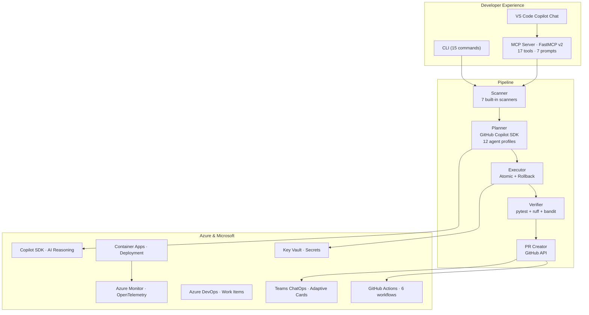

# CodeCustodian Documentation

## Problem

Engineering teams spend **40–60 % of their time** on maintenance work — migrating
deprecated APIs, converting stale TODO comments, remediating code smells, patching
security issues, and chasing architectural drift. This work is necessary but rarely
prioritized, creating a growing backlog that slows every sprint.

## Solution

**CodeCustodian** is an autonomous AI agent that takes that maintenance burden off the
team. It scans a Python codebase for technical debt, plans safe refactorings with the
**GitHub Copilot SDK**, applies them atomically with a 7-point safety system, verifies
the result with tests and linting, and opens pull requests with full AI reasoning —
keeping humans in control while automating the grunt work.

It operates as a **CLI tool** (15 commands), a **GitHub Actions workflow**, and a
**FastMCP v2 server** (17 tools, 7 prompts) that plugs directly into VS Code Copilot
Chat.

---

## Prerequisites

| Requirement | Version |
|-------------|---------|
| Python | 3.11+ |
| Git | 2.x |
| GitHub account | Copilot subscription (any tier) |
| OS | Windows, macOS, or Linux |

Optional for Azure deployment: Azure CLI, Docker, Bicep CLI.

---

## Setup

```bash
# Clone
git clone https://github.com/Nizarel/CodeCustodian.git
cd CodeCustodian

# Install (with uv)
uv sync --all-extras

# Or with pip
pip install -e ".[dev]"

# Initialize config
codecustodian init

# Scan a repository
codecustodian scan --repo-path .

# Full pipeline (dry-run)
codecustodian run --dry-run

# Start MCP server
codecustodian-mcp
```

> **Full CLI reference:** See [TOOLS_AND_USAGE.md](TOOLS_AND_USAGE.md#cli-commands)

---

## Deployment

CodeCustodian deploys to **Azure Container Apps** via Bicep IaC:

```
Azure Container Apps  ←  Docker image (multi-stage, non-root)
Azure Key Vault       ←  Secrets (GitHub token, Teams webhook)
Azure Monitor         ←  OpenTelemetry traces & logs
GitHub Actions        ←  6 CI/CD workflows (ci, deploy-azure, security-scan, …)
```

```bash
# Build & deploy
az deployment group create \
  --resource-group Custodian-Rg \
  --template-file infra/main.bicep \
  --parameters infra/parameters.dev.bicepparam

# Smoke test
pwsh ./scripts/smoke-mcp-remote.ps1 -Fqdn "<your-app-fqdn>"
```

> **Full deployment guide:** See [DEPLOYMENT.md](DEPLOYMENT.md)

---

## Architecture Diagram



> **Full architecture details:** See [FEATURE_ARCHITECTURE.md](FEATURE_ARCHITECTURE.md)

---

## Responsible AI

CodeCustodian enforces Responsible AI principles at every stage:

| Principle | Implementation |
|-----------|---------------|
| **Human-in-the-loop** | All changes go through pull requests; no auto-merge by default |
| **Explainability** | Every PR includes AI reasoning, confidence factors, and alternatives |
| **Confidence gating** | 8–10 → PR · 5–7 → draft PR · <5 → proposal only |
| **Safety checks** | 7-point system: syntax, file size, binary, path traversal, encoding, secrets, blast radius |
| **Privacy** | No source code leaves the local environment except through the Copilot SDK API |
| **Audit trail** | SHA-256 tamper-evident log for every action |
| **Fairness** | Reviewer routing based on expertise and capacity, not seniority |
| **Accountability** | Full traceability from finding → plan → change → verification → PR |

> **Full Responsible AI policy:** See [RESPONSIBLE_AI.md](RESPONSIBLE_AI.md)

---

## Documentation Map

| Document | Description |
|----------|-------------|
| [Feature Architecture](FEATURE_ARCHITECTURE.md) | Detailed architecture for every subsystem, SDK integration flows, data models, Mermaid diagrams |
| [Competitive Features](COMPETITIVE_FEATURES.md) | Feature inventory, competitive landscape, SDK usage details |
| [Tools & Usage](TOOLS_AND_USAGE.md) | Complete CLI reference, MCP tools / resources / prompts, configuration schema |
| [Deployment](DEPLOYMENT.md) | Installation, Docker, GitHub Actions, Azure Container Apps deployment guide |
| [Responsible AI](RESPONSIBLE_AI.md) | Human-in-the-loop, explainability, safety checks, privacy, and accountability |
| [Project Summary](PROJECT_SUMMARY.md) | 150-word elevator pitch |

### Requirements (planning documents)

| Document | Description |
|----------|-------------|
| [Business Requirements](Requirements/business-requirements.md) | Full BRD — stakeholders, market analysis, business requirements |
| [Features & Challenge Spec](Requirements/features-requirements-challenge-optimized.md) | Technical feature requirements organized by scoring categories |
| [Implementation Plan](Requirements/implementation-plan.md) | Phased build plan (Phases 1–11) with task checklists |

### Root-level files

- [CONTRIBUTING.md](../CONTRIBUTING.md) — Development setup and contribution workflow
- [CHANGELOG.md](../CHANGELOG.md) — Version history
- [SECURITY.md](../SECURITY.md) — Security policy and vulnerability disclosure
- [AGENTS.md](../AGENTS.md) — Custom instructions for GitHub Copilot
